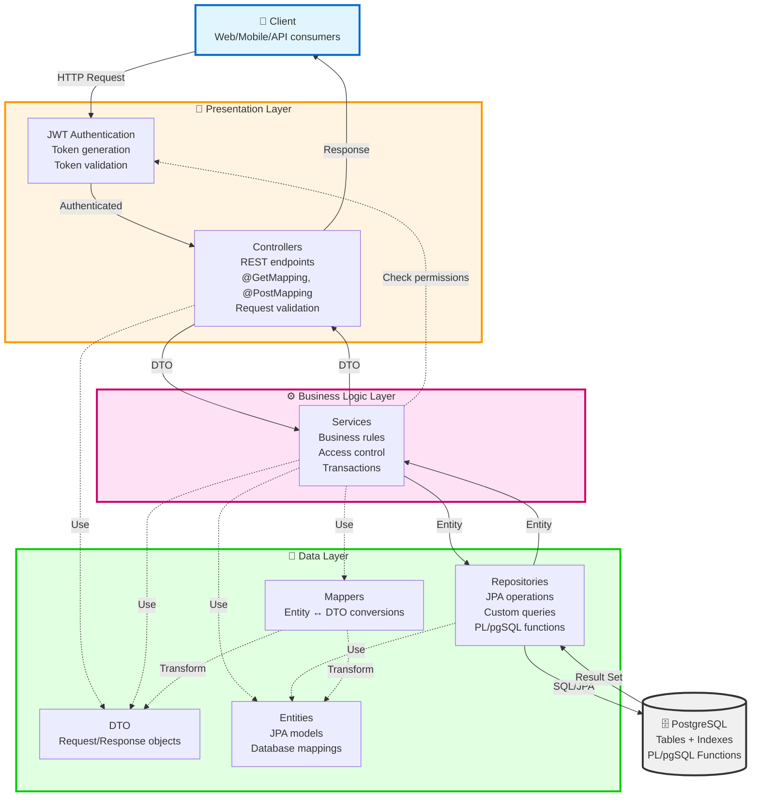

# Papers, Please - Система управления УПК (Учреждений по приему и проверке)

## 📋 Описание системы

**Papers, Please** — это информационная система для автоматизации работы учреждений по приему и проверке документов мигрантов (УПК). Система предназначена для управления процессами проверки документов, обработки заявок, координации работы персонала и мониторинга деятельности УПК.

### Основные возможности:
- 👤 Управление пользователями с различными ролями и уровнями доступа
- 📄 Управление документами мигрантов с валидацией сроков действия
- 🎫 Обработка заявок (тикетов) на различные типы услуг
- 🏢 Управление учреждениями (УПК) и их персоналом
- 👥 Формирование и управление сменами сотрудников
- 🔔 Система уведомлений для пользователей
- 📊 Отслеживание событий и действий в системе
- 🔐 JWT-аутентификация и детальная система авторизации

---

## 🛠 Технологический стек

### Backend
- **Язык**: Kotlin 2.0.21
- **Фреймворк**: Spring Boot 3.3.5
  - Spring Web (REST API)
  - Spring Data JPA (ORM)
  - Spring Security (авторизация и аутентификация)
  - Spring Validation
- **База данных**: PostgreSQL
- **Миграции**: Flyway
- **Аутентификация**: JWT (JSON Web Tokens) - `io.jsonwebtoken:jjwt 0.12.6`
- **Документация API**: SpringDoc OpenAPI 2.3.0
- **Линтер**: Detekt 1.23.8
- **Сериализация**: Jackson (с поддержкой Kotlin и JSR310)
- **Сборка**: Gradle с Kotlin DSL
- **Java**: 17

---

## 👥 Иерархия ролей

Система поддерживает 5 ролей с различными уровнями доступа:

### 1. **GOD** 🔱
- **Суперадминистратор** с полным доступом ко всем ресурсам
- Может выполнять любые операции в системе
- Обход всех проверок доступа

### 2. **BOSS** 👔
- **Начальник УПК**
- Управление персоналом своего УПК
- Просмотр и управление тикетами своего УПК
- Формирование смен
- Обработка апелляций
- Доступ только к ресурсам своего УПК

### 3. **INSPECTOR** 🔍
- **Инспектор УПК**
- Обработка тикетов своего УПК
- Проверка документов мигрантов
- Просмотр информации о тикетах и документах в рамках своего УПК

### 4. **SECURITY** 🛡️
- **Сотрудник безопасности УПК**
- Просмотр документов и тикетов своего УПК
- Доступ к информации о пользователях в рамках своего УПК

### 5. **MIGRANT** 🧳
- **Мигрант** (пользователь системы)
- Создание и управление своими документами
- Создание заявок (тикетов)
- Просмотр только своих данных

---

## 🔐 Матрица доступа к API endpoints

### 🔓 Публичные endpoints (без аутентификации)

| Endpoint | Метод | Описание |
|----------|-------|----------|
| `/api/v1/auth/register` | POST | Регистрация нового пользователя |
| `/api/v1/auth/register-god` | POST | Регистрация GOD пользователя (требуется секретный ключ) |
| `/api/v1/auth/login` | POST | Авторизация в системе |
| `/api/v1/documents/active` | GET | Получение активных документов пользователя (по userId) |

### 👤 Управление пользователями (`/api/v1/users`)

| Endpoint | Метод | Роли | Описание |
|----------|-------|------|----------|
| `GET /` | GET | BOSS, GOD | Получить всех пользователей (с пагинацией) |
| `GET /me` | GET | **ВСЕ** | Получить информацию о текущем пользователе |
| `PATCH /me` | PATCH | **ВСЕ** | Обновить информацию о текущем пользователе |
| `GET /{id}` | GET | BOSS, SECURITY, GOD | Получить пользователя по ID |
| `GET /{id}/boss-details` | GET | BOSS, GOD | Получить детальную информацию о боссе (подчинённые, смены) |
| `GET /{id}/details` | GET | **ВСЕ** | Получить полную информацию о пользователе (смены, участие)* |
| `POST /` | POST | BOSS, GOD | Создать нового пользователя |
| `PATCH /{id}` | PATCH | BOSS, GOD | Обновить пользователя |
| `DELETE /{id}` | DELETE | BOSS, GOD | Удалить пользователя |

> *Пользователь может просматривать свои собственные детали. BOSS может просматривать детали пользователей только из своего УПК. GOD имеет доступ ко всем пользователям.

### 📄 Управление документами (`/api/v1/documents`)

| Endpoint | Метод | Роли | Описание |
|----------|-------|------|----------|
| `GET /` | GET | INSPECTOR, BOSS, SECURITY, GOD, MIGRANT | Получить документы по userId (поддерживает фильтр `attachToProfileOnly`)* |
| `GET /active` | GET | **ПУБЛИЧНЫЙ** | Получить активные (не истекшие) документы |
| `GET /{id}` | GET | INSPECTOR, BOSS, SECURITY, GOD, MIGRANT | Получить документ по ID |
| `POST /` | POST | MIGRANT, GOD | Создать новый документ (с полем `attachToProfile`)** |
| `PATCH /{id}` | PATCH | MIGRANT, GOD | Обновить документ (включая поле `attachToProfile`)** |
| `DELETE /{id}` | DELETE | GOD | Удалить документ |
| `GET /ticket/{ticketId}` | GET | INSPECTOR, BOSS, SECURITY, GOD | Получить документы тикета (только своего УПК)*** |

> *Query-параметр `attachToProfileOnly=true` фильтрует документы, которые мигрант отметил для отображения в профиле
>
> **Поле `attachToProfile` (boolean) позволяет мигранту пометить документы для сохранения в истории профиля
>
> ***Доступ только для сотрудников УПК, к которому относится тикет

### 🎫 Управление тикетами (`/api/v1/tickets`)

| Endpoint | Метод | Роли | Описание |
|----------|-------|------|----------|
| `GET /` | GET | INSPECTOR, BOSS, SECURITY, MIGRANT, GOD | Получить тикеты (с фильтрацией), включая полную информацию об executor* |
| `GET /{id}` | GET | INSPECTOR, BOSS, SECURITY, MIGRANT, GOD | Получить детали тикета с полными объектами executor, relatedTickets, documents* |
| `POST /` | POST | INSPECTOR, BOSS, SECURITY, MIGRANT, GOD | Создать новый тикет**** |
| `PATCH /{id}` | PATCH | INSPECTOR, BOSS, SECURITY, MIGRANT, GOD | Обновить тикет***** |
| `DELETE /{id}` | DELETE | MIGRANT, BOSS, GOD | Удалить тикет****** |
| `POST /{id}/delegate` | POST | INSPECTOR, BOSS, SECURITY, GOD | Делегировать тикет (создать дочерний/кросс-проверку/арест)******* |
| `GET /{id}/documents` | GET | INSPECTOR, BOSS, SECURITY, MIGRANT, GOD | Получить документы тикета (только своего УПК)** |
| `POST /{id}/documents/{documentId}` | POST | INSPECTOR, BOSS, SECURITY, MIGRANT, GOD | Прикрепить документ к тикету*** |
| `DELETE /{id}/documents/{documentId}` | DELETE | INSPECTOR, BOSS, SECURITY, MIGRANT, GOD | Открепить документ от тикета*** |
| `GET /{id}/related` | GET | INSPECTOR, BOSS, SECURITY, GOD | Получить связанные тикеты |
| `POST /{id}/related/{relatedTicketId}` | POST | INSPECTOR, BOSS, SECURITY, GOD | Связать тикеты |
| `DELETE /{id}/related/{relatedTicketId}` | DELETE | INSPECTOR, BOSS, SECURITY, GOD | Удалить связь между тикетами |

> *В версии 1.3.0+ тикеты возвращаются с полными объектами executor (вместо только executorId)
> 
> **Доступ только для сотрудников УПК, к которому относится тикет. MIGRANT может просматривать документы только своих тикетов
>
> ***MIGRANT может управлять документами только для тикетов, где он является автором
>
> ****При создании EXTERNAL тикета (заявки от мигранта) без указания executorId, система автоматически назначает инспектора со специализацией PASSPORT с наименьшим количеством активных тикетов (статусы: OPEN, IN_PROGRESS, NEED_INFO). Если инспекторов с PASSPORT нет, назначается любой инспектор УПК
>
> *****MIGRANT может обновлять только свои тикеты и только закрывать их (изменение status на CLOSED). Другие поля недоступны для изменения мигрантами
>
> ******При удалении тикета автоматически удаляются все связи с другими тикетами и документами
>
> *******POST `/tickets/{id}/delegate` - Делегирование тикета создает новый тикет на основе существующего с автоматическим назначением исполнителя. Поддерживает три типа делегирования:
> - **INTERNAL** (дочерний тикет) - назначается на инспектора с указанной специализацией с наименьшей загруженностью
> - **CROSSCHECK** (кросс-проверка) - назначается на другого инспектора (не текущего) с наименьшей загруженностью
> - **ARREST** (арест) - назначается на сотрудника безопасности с наименьшей загруженностью
> 
> При делегировании автоматически копируются документы оригинального тикета и создается двусторонняя связь между тикетами

### 🏢 Управление УПК (`/api/v1/upks`)

| Endpoint | Метод | Роли | Описание |
|----------|-------|------|----------|
| `GET /` | GET | BOSS, GOD | Получить все УПК |
| `GET /{id}` | GET | BOSS, GOD | Получить УПК по ID |
| `POST /` | POST | BOSS, GOD | Создать новый УПК |
| `PATCH /{id}` | PATCH | BOSS, GOD | Обновить УПК |
| `DELETE /{id}` | DELETE | GOD | Удалить УПК |
| `GET /{id}/employees` | GET | BOSS, GOD | Получить сотрудников УПК (только своего УПК для BOSS)** |

> **BOSS может видеть только сотрудников СВОЕГО УПК

### 👥 Управление сменами (`/api/v1/shifts`)

| Endpoint | Метод | Роли | Описание |
|----------|-------|------|----------|
| `GET /` | GET | INSPECTOR, BOSS, SECURITY, GOD | Получить все смены (с фильтрацией)* |
| `GET /{id}` | GET | INSPECTOR, BOSS, SECURITY, GOD | Получить смену по ID |
| `GET /{id}/details` | GET | INSPECTOR, BOSS, SECURITY, GOD | Получить детали смены (инспекторы, статистика)** |
| `POST /` | POST | BOSS, GOD | Создать новую смену |
| `PATCH /{id}` | PATCH | BOSS, GOD | Обновить смену |
| `DELETE /{id}` | DELETE | GOD | Удалить смену |
| `POST /{id}/participants/{userId}` | POST | BOSS, GOD | Добавить участника в смену |
| `DELETE /{id}/participants/{userId}` | DELETE | BOSS, GOD | Удалить участника из смены |

> *Поддерживаемые фильтры (query-параметры):
> - `createdBy` - фильтр по ID пользователя, создавшего смену
> - `upkId` - фильтр по ID УПК
> - `endTimeNotNull` - фильтр по статусу завершения смены (true - завершенные, false - активные)
>
> **Поле `passedCrossChecks` в детализации смены теперь всегда возвращает 0, так как события больше не привязаны к сменам

### 🔔 Управление уведомлениями (`/api/v1/notifications`)

| Endpoint | Метод | Роли | Описание |
|----------|-------|------|----------|
| `GET /` | GET | **ВСЕ** | Получить уведомления текущего пользователя |
| `PATCH /{id}/read` | PATCH | **ВСЕ** | Пометить уведомление как прочитанное |
| `DELETE /{id}` | DELETE | **ВСЕ** | Удалить уведомление |

### 📊 Управление событиями (`/api/v1/events`)

| Endpoint | Метод | Роли | Описание |
|----------|-------|------|----------|
| `GET /` | GET | INSPECTOR, BOSS, SECURITY, GOD | Получить все события (с фильтром по upkId)* |
| `GET /{id}` | GET | INSPECTOR, BOSS, SECURITY, GOD | Получить событие по ID |
| `POST /` | POST | BOSS, GOD | Создать событие с приоритетом и привязкой к УПК** |
| `PATCH /{id}` | PATCH | BOSS, GOD | Обновить событие*** |
| `DELETE /{id}` | DELETE | BOSS, GOD | Удалить событие**** |

> *События теперь привязаны к конкретному УПК. BOSS видит только события своего УПК, GOD - все события. Поддерживается фильтрация по `upkId` через query-параметр
>
> **При создании события обязательно указывается `upkId` - УПК, к которому относится событие. Поле `priority` (LOW, NORMAL, HIGH, CRITICAL) используется для отображения важности. Значение по умолчанию: `NORMAL`
>
> ***BOSS может обновлять только события своего УПК, GOD - любые события
>
> ****BOSS может удалять только события своего УПК, GOD - любые события

---

## 📊 Детальные endpoints

### 🎫 POST `/api/v1/tickets` - Создание тикета с автоматическим назначением

**Описание**: При создании EXTERNAL тикета (заявки от мигранта) система автоматически назначает исполнителя

**Роли**: INSPECTOR, BOSS, SECURITY, MIGRANT, GOD

**Логика автоматического назначения**:

1. **Если указан `executorId`** - тикет назначается на указанного пользователя
2. **Если `ticketType` == `EXTERNAL` и `executorId` НЕ указан**:
   - Система находит УПК, к которому привязан `subject` (мигрант)
   - Ищет всех инспекторов (`INSPECTOR`) этого УПК
   - Подсчитывает количество активных тикетов для каждого инспектора
   - Назначает тикет на инспектора с **наименьшим количеством активных тикетов**
   - Отправляет уведомление назначенному инспектору

**Активные тикеты** - тикеты со статусами:
- `OPEN` - открыт
- `IN_PROGRESS` - в работе
- `NEED_INFO` - требуется информация

**Примеры запросов**:

#### Создание EXTERNAL тикета с автоматическим назначением:

```bash
POST /api/v1/tickets
Authorization: Bearer {migrant_token}
Content-Type: application/json

{
  "ticketType": "EXTERNAL",
  "status": "OPEN",
  "priority": "NORMAL",
  "authorId": "migrant-uuid",
  "subjectId": "migrant-uuid",
  "description": "Проверка документов для работы"
  // executorId не указан - автоматически назначится инспектор
}
```

**Ответ**:
```json
{
  "id": "new-ticket-uuid",
  "ticketType": "EXTERNAL",
  "status": "OPEN",
  "priority": "NORMAL",
  "authorId": "migrant-uuid",
  "subjectId": "migrant-uuid",
  "executor": {
    "id": "inspector-uuid",
    "name": "Иван Инспектор",
    "email": "ivan@upk.ru",
    "role": "INSPECTOR",
    "upkId": "upk-uuid"
  },
  "description": "Проверка документов для работы",
  "createdAt": "2025-12-14T10:00:00Z",
  "updatedAt": "2025-12-14T10:00:00Z"
}
```

#### Закрытие тикета мигрантом:

Мигрант может закрыть свою заявку, изменив статус на `CLOSED`:

```bash
PATCH /api/v1/tickets/{ticket-id}
Authorization: Bearer {migrant_token}
Content-Type: application/json

{
  "status": "CLOSED"
}
```

**Ответ**:
```json
{
  "id": "ticket-uuid",
  "ticketType": "EXTERNAL",
  "status": "CLOSED",
  "priority": "NORMAL",
  "authorId": "migrant-uuid",
  "subjectId": "migrant-uuid",
  "executor": {
    "id": "inspector-uuid",
    "name": "Иван Инспектор",
    "email": "ivan@upk.ru",
    "role": "INSPECTOR",
    "upkId": "upk-uuid"
  },
  "description": "Проверка документов для работы",
  "createdAt": "2025-12-14T10:00:00Z",
  "updatedAt": "2025-12-14T12:30:00Z"
}
```

> ⚠️ **Важно**: Мигрант может изменять только поле `status` и только на значение `CLOSED`. Попытка изменить другие поля (priority, description, executor и т.д.) приведет к ошибке `403 Forbidden`.

#### Создание тикета с явным указанием исполнителя:

```bash
POST /api/v1/tickets
Content-Type: application/json

{
  "ticketType": "INTERNAL",
  "status": "OPEN",
  "priority": "HIGH",
  "authorId": "boss-uuid",
  "subjectId": "migrant-uuid",
  "executorId": "specific-inspector-uuid",  // Явно указан исполнитель
  "description": "Внутренняя проверка"
}
```

**Примечания**:
- Автоматическое назначение работает **только** для `EXTERNAL` тикетов
- Если в УПК нет доступных инспекторов, тикет создастся без исполнителя (`executor: null`)
- Инспектор с наименьшей нагрузкой получит уведомление о назначении

---

### 👤 GET `/api/v1/users/{id}/boss-details`

**Описание**: Получить детальную информацию о боссе УПК (работает только для пользователей с ролью BOSS)

**Роли**: BOSS, GOD

**Формат ответа**:
```json
{
  "id": "uuid",
  "name": "string",
  "email": "string",
  "role": "BOSS",
  "upk": {
    "id": "uuid",
    "name": "string",
    "region": "REGION"
  },
  "subordinates": [
    {
      "id": "uuid",
      "name": "string",
      "email": "string",
      "role": "INSPECTOR | SECURITY",
      "upkId": "uuid"
    }
  ],
  "shifts": [
    {
      "id": "uuid",
      "startTime": "2024-01-01T08:00:00Z",
      "endTime": "2024-01-01T20:00:00Z",
      "createdBy": "uuid",
      "upkId": "uuid"
    }
  ]
}
```

**Примечания**:
- В `subordinates` не включаются пользователи с ролью `MIGRANT`
- Сам босс не отображается в собственном списке подчиненных
- Отображаются только сотрудники УПК: `INSPECTOR` и `SECURITY`

### 👤 GET `/api/v1/users/{id}/details`

**Описание**: Получить полную информацию о пользователе со всеми сменами и статистикой

**Роли**: **ВСЕ** аутентифицированные пользователи

**Правила доступа**:
- Любой пользователь может просматривать **свои собственные** детали
- BOSS может просматривать детали пользователей только из **своего УПК**
- GOD имеет доступ ко **всем** пользователям

**Формат ответа**:
```json
{
  "id": "uuid",
  "name": "string",
  "email": "string",
  "passwordHash": null,
  "role": "INSPECTOR | SECURITY | etc",
  "upk": {
    "id": "uuid",
    "name": "string",
    "region": "REGION"
  },
  "boss": {
    "id": "uuid",
    "name": "string",
    "email": "string",
    "role": "BOSS"
  },
  "shifts": [
    {
      "id": "uuid",
      "startTime": "2024-01-01T08:00:00Z",
      "endTime": "2024-01-01T20:00:00Z",
      "createdBy": "uuid",
      "upkId": "uuid",
      "boss": {
        "id": "uuid",
        "name": "string",
        "email": "string",
        "role": "BOSS"
      },
      "upk": {
        "id": "uuid",
        "name": "string",
        "region": "REGION"
      },
      "participation": {
        "userId": "uuid",
        "shiftId": "uuid",
        "wage": 1.5,
        "penalty": 0.2,
        "specialization": "PASSPORT | LOCALS | WORK | TRANSIT | SPECIAL",
        "resolvedTickets": 15
      }
    }
  ]
}
```

### 👥 GET `/api/v1/shifts/{id}/details`

**Описание**: Получить детальную информацию о смене с инспекторами и статистикой

**Роли**: INSPECTOR, BOSS, SECURITY, GOD

**Формат ответа**:
```json
{
  "id": "uuid",
  "startTime": "2024-01-01T08:00:00Z",
  "endTime": "2024-01-01T20:00:00Z",
  "createdBy": "uuid",
  "upk": {
    "id": "uuid",
    "name": "string",
    "region": "REGION"
  },
  "boss": {
    "id": "uuid",
    "name": "string",
    "email": "string",
    "role": "BOSS"
  },
  "inspectors": [
    {
      "userId": "uuid",
      "shiftId": "uuid",
      "wage": 1.5,
      "penalty": 0.2,
      "specialization": "PASSPORT | LOCALS | WORK | TRANSIT | SPECIAL",
      "resolvedTickets": 15,
      "passedCrossChecks": 8
    }
  ]
}
```

**Поля участия (participation)**:
- `wage` - коэффициент оплаты/премии (вместо старого `coeffBonus`)
- `penalty` - коэффициент штрафа (вместо старого `coeffPenalty`)
- `resolvedTickets` - количество решённых тикетов инспектором в этой смене
- `passedCrossChecks` - количество пройденных кросс-проверок

---

### 👥 GET `/api/v1/participations`

**Описание**: Получить список participations (участий в сменах) с информацией о завершенных тикетах

**Роли**: INSPECTOR, BOSS, SECURITY, GOD

**Query параметры**:
- `shiftId` (опционально) - фильтр по смене
- `userId` (опционально) - фильтр по пользователю
- `limit` (по умолчанию 10) - количество записей на страницу
- `offset` (по умолчанию 0) - смещение для пагинации

**Формат ответа**:
```json
{
  "items": [
    {
      "id": "uuid",
      "userId": "uuid",
      "shiftId": "uuid",
      "wage": 1.5,
      "penalty": 0.2,
      "specialization": "PASSPORT | LOCALS | WORK | TRANSIT | SPECIAL",
      "totalResolvedTickets": 3
    }
  ],
  "total": 10,
  "limit": 10,
  "offset": 0
}
```

**Поля**:
- `totalResolvedTickets` - количество завершенных (`CLOSED`) тикетов для данного пользователя в данной смене
- Значение вычисляется динамически и не хранится в БД
- Учитываются только тикеты где пользователь является executor'ом

---

## 📌 Управление документами в профиле мигранта (`attachToProfile`)

### Описание

Поле `attachToProfile` позволяет мигрантам помечать документы, которые они хотят сохранить в истории своего профиля. Это полезно для:

- 📋 Отображения избранных документов на странице профиля пользователя
- 🗂️ Создания персональной истории важных документов
- 🔍 Быстрого доступа к ключевым документам без просмотра всех

### Основные характеристики

- **Тип поля**: `Boolean`
- **Значение по умолчанию**: `false`
- **Доступ для изменения**: MIGRANT (для своих документов), GOD
- **Фильтрация**: Поддерживается query-параметр `attachToProfileOnly`
- **Миграция БД**: `V2__add_attach_to_profile_to_documents.sql` (применяется автоматически при запуске)

### Примеры использования

#### 1. Создание документа с прикреплением к профилю

```json
POST /api/v1/documents
{
  "userId": "user-uuid",
  "documentType": "PASSPORT",
  "body": { ... },
  "attachToProfile": true  // Сразу прикрепить к профилю
}
```

#### 2. Обновление существующего документа

```json
PATCH /api/v1/documents/{id}
{
  "attachToProfile": true  // Прикрепить к профилю
}
```

#### 3. Получение только документов из профиля

```bash
GET /api/v1/documents?userId={userId}&attachToProfileOnly=true
```

### Сценарии использования

**Сценарий 1: Мигрант готовит пакет документов для проверки**
1. Загружает несколько версий паспорта
2. Помечает актуальную версию как `attachToProfile: true`
3. Инспектор видит помеченный документ в профиле мигранта

**Сценарий 2: История важных документов**
1. Мигрант загружает разрешение на работу: `attachToProfile: true`
2. Загружает временный документ для тикета: `attachToProfile: false`
3. На странице профиля отображается только разрешение на работу

**Сценарий 3: Управление видимостью**
1. Мигрант прикрепил старый паспорт к профилю
2. Получил новый паспорт
3. Обновляет старый: `PATCH {"attachToProfile": false}`
4. Прикрепляет новый: `PATCH {"attachToProfile": true}`

### API endpoints с поддержкой `attachToProfile`

| Endpoint | Параметр | Описание |
|----------|----------|----------|
| `POST /documents` | `attachToProfile` в теле | Создать документ с флагом |
| `PATCH /documents/{id}` | `attachToProfile` в теле | Изменить статус документа |
| `GET /documents` | `attachToProfileOnly` в query | Фильтр по прикрепленным |

### Правила доступа

- **MIGRANT**: Может управлять флагом только для своих документов
- **INSPECTOR, BOSS, SECURITY**: Могут видеть флаг, но не изменять
- **GOD**: Полный доступ к управлению флагом

---

## 🗄️ База данных: Индексы и PL/pgSQL функции

### 🔄 Миграции Flyway

Все изменения схемы базы данных управляются через Flyway миграции:

| Версия | Файл | Описание |
|--------|------|----------|
| V2 | `V2__add_attach_to_profile_to_documents.sql` | Добавляет поле `attach_to_profile` в таблицу `documents` для фильтрации документов в профиле мигранта |
| V4 | `V4__remove_coefficient_columns_from_participations.sql` | Удаляет устаревшие колонки `bonus_coefficient` и `penalty_coefficient` (заменены на `wage` и `penalty`) |
| V5 | `V5__update_notification_type_constraint.sql` | Обновляет check constraint для `notification_type`, добавляя `TICKET_UPDATED` |
| V6 | `V6__remove_shift_id_add_priority_to_events.sql` | Удаляет привязку событий к сменам (`shift_id`) и добавляет поле `priority` |
| V7 | `V7__add_approved_status_to_tickets.sql` | Добавляет статус `APPROVED` (одобрен) для тикетов |
| V8 | `V8__add_upk_id_to_events.sql` | Добавляет поле `upk_id` в таблицу `events` для привязки событий к конкретному УПК |

**Важно**: Миграции применяются автоматически при запуске приложения. Конфигурация в `application.yaml`:
```yaml
flyway:
  enabled: true
  baseline-on-migrate: true
  out-of-order: true  # Разрешает применение миграций вне порядка
```

### 📊 Индексы для оптимизации запросов

Система использует индексы для ускорения критических операций:

#### Таблица `users`
- **idx_user_email** (UNIQUE) - поиск пользователей по email при авторизации

#### Таблица `documents`
- **idx_document_owner** - быстрый поиск документов по владельцу
- **idx_document_attach_to_profile** - быстрая фильтрация документов, прикрепленных к профилю (partial index для `attach_to_profile=true`)

#### Таблица `tickets`
- **idx_ticket_executor_status** - фильтрация тикетов по исполнителю и статусу
- **idx_ticket_author** - поиск тикетов по автору

#### Таблица `notifications`
- **idx_notification_user_read_time** - получение непрочитанных уведомлений пользователя

---

### ⚡ PL/pgSQL Функции

Система использует оптимизированные PostgreSQL функции для повышения производительности критических операций.

#### 1. `get_active_documents(p_owner_id UUID)`
**Назначение**: Получение всех активных (не истекших) документов пользователя

**Возвращаемые поля**:
- `id` (UUID)
- `document_type` (VARCHAR)
- `body` (TEXT)
- `issued_at` (TIMESTAMP WITH TIME ZONE)
- `expires_at` (TIMESTAMP WITH TIME ZONE)
- `uploaded_at` (TIMESTAMP WITH TIME ZONE)
- `owner_id` (UUID)

**Логика**:
```sql
SELECT документы WHERE owner_id = p_owner_id 
  AND (expires_at IS NULL OR expires_at > NOW())
```

**Применение**: Просмотр документов мигранта, проверка документов инспектором

---

#### 2. `get_ticket_documents(p_ticket_id UUID)`
**Назначение**: Получение всех документов, прикрепленных к тикету

**Возвращаемые поля**:
- `id` (UUID)
- `document_type` (VARCHAR)
- `body` (TEXT)
- `issued_at` (TIMESTAMP WITH TIME ZONE)
- `expires_at` (TIMESTAMP WITH TIME ZONE)
- `owner_name` (VARCHAR) - имя владельца документа

**Логика**:
```sql
SELECT документы 
FROM documents d
JOIN ticket_documents td ON d.id = td.document_id
JOIN users u ON d.owner_id = u.id
WHERE td.ticket_id = p_ticket_id
ORDER BY d.document_type
```

**Применение**: Проверка документов инспектором при обработке заявки

---

#### 3. `get_users_by_upk(p_upk_id UUID)`
**Назначение**: Получение списка всех сотрудников УПК

**Возвращаемые поля**:
- `id` (UUID)
- `email` (VARCHAR)
- `name` (VARCHAR)
- `password_hash` (VARCHAR)
- `role` (VARCHAR)
- `upk_id` (UUID)

**Логика**:
```sql
SELECT пользователи 
FROM users u
WHERE u.upk_id = p_upk_id
ORDER BY u.role, u.name
```

**Применение**: Формирование смены начальником УПК, управление персоналом УПК

---

#### 4. `countByExecutor_IdAndStatusAndShift_Id(executor_id UUID, status VARCHAR, shift_id UUID)`
**Назначение**: Подсчет количества тикетов с определенным статусом для конкретного исполнителя в рамках смены

**Возвращает**: `BIGINT` - количество тикетов

**Логика**:
```sql
SELECT COUNT(*) 
FROM tickets
WHERE executor_id = p_executor_id
  AND status = p_status
  AND shift_id = p_shift_id
```

**Применение**: Расчет статистики производительности сотрудника в конкретной смене (поле `totalResolvedTickets` в Participation API)

---

## 🏗️ Архитектура системы

Проект построен по классической многослойной архитектуре:



### Описание архитектурных слоев:

#### 📱 **Presentation Layer** (`controller/`, `security/`, `config/`)
Слой представления, отвечающий за взаимодействие с клиентом и безопасность:
- **Controllers**: обработка HTTP запросов/ответов, маршрутизация endpoints
- **JWT Authentication**: аутентификация, генерация и валидация токенов
- Первичная валидация данных (`@Valid`)
- Авторизация доступа (`@PreAuthorize`)

#### ⚙️ **Business Logic Layer** (`service/`)
Слой бизнес-логики, содержащий основную логику приложения:
- Реализация бизнес-правил
- Проверка прав доступа к ресурсам
- Управление транзакциями (`@Transactional`)
- Координация работы между репозиториями
- Обработка бизнес-логики документов, тикетов, УПК

#### 💾 **Data Layer** (`repository/`, `model/`, `dto/`, `mapper/`)
Слой данных, включающий работу с базой данных и структуры данных:
- **Repositories**: абстракция работы с БД, CRUD операции, кастомные SQL запросы, PL/pgSQL функции
- **Entities**: JPA сущности, отображающие таблицы базы данных
- **DTO**: объекты передачи данных между слоями
- **Mappers**: преобразование Entity ↔ DTO

---

## 📁 Структура проекта

```
papersplease/
├── src/main/kotlin/com/arekalov/papersplease/
│   ├── config/           # Конфигурация Spring (Security, JWT)
│   ├── controller/       # REST API контроллеры
│   │   ├── AuthController.kt
│   │   ├── UserController.kt
│   │   ├── DocumentController.kt
│   │   ├── TicketController.kt
│   │   ├── UpkController.kt
│   │   ├── ShiftController.kt
│   │   ├── NotificationController.kt
│   │   ├── EventController.kt
│   │   └── ParticipationController.kt
│   ├── service/          # Бизнес-логика
│   ├── repository/       # JPA репозитории
│   ├── model/            # Entities и Enums
│   ├── dto/              # Data Transfer Objects
│   ├── mapper/           # Mappers (Entity ↔ DTO)
│   ├── security/         # JWT и Security
│   ├── validation/       # Custom validators
│   └── exception/        # Exception handlers
├── src/main/resources/
│   ├── application.yaml  # Конфигурация приложения
│   └── db/migration/     # Flyway миграции
├── docs/                 # Документация
│   ├── openapi.yaml      # OpenAPI спецификация
│   └── wiki/             # Wiki документация
├── scripts/              # SQL скрипты (seed, clear)
│   ├── seed-data-prod.sql
│   ├── clear-data-prod.sql
│   └── fix-functions.sql
├── deployment/           # Скрипты для деплоя
│   ├── deploy.sh
│   ├── start.sh
│   ├── cleanup.sh
│   └── application-prod.yaml
└── build.gradle.kts      # Gradle конфигурация
```

---

## 🕐 Формат дат и времени

### Типы данных

В системе используется тип **`java.time.Instant`** для всех дат и времени.

### Формат передачи данных

**Все даты в API передаются и возвращаются в формате ISO-8601 (UTC)**:

```
YYYY-MM-DDTHH:mm:ss.SSSSSSZ
```

### Конфигурация Jackson

В `application.yaml` настроена сериализация дат:

```yaml
jackson:
  serialization:
    write-dates-as-timestamps: false  # Даты как строки, не timestamp
  time-zone: UTC                        # Часовой пояс UTC
```

### Примеры форматов

#### ✅ Правильные форматы:

```json
{
  "createdAt": "2025-11-23T19:00:56.476695Z",
  "startTime": "2025-11-23T16:04:10.898247+00:00",
  "validFrom": "2020-01-01T00:00:00Z",
  "validUntil": "2030-01-01T00:00:00Z",
  "deadlineAt": "2025-01-05T18:00:00Z"
}
```

**Форматы, которые Jackson поддерживает**:
- `2025-11-23T19:00:56.476695Z` (с миллисекундами, UTC)
- `2025-11-23T16:04:10.898247+00:00` (с миллисекундами и timezone)
- `2025-11-23T16:04:10Z` (без миллисекунд, UTC)
- `2025-11-23T16:04:10+00:00` (без миллисекунд, с timezone)
- `2020-01-01T00:00:00Z` (полночь UTC)

#### ❌ Неправильные форматы:

```json
{
  "createdAt": "2025-11-23 19:00:56",        // Нет 'T' и timezone
  "startTime": "23.11.2025 16:04:10",        // Неправильный формат
  "validFrom": 1609459200000,                // Timestamp (число)
  "validUntil": "2030-01-01"                 // Только дата без времени
}
```

### Примеры использования в запросах

#### Создание тикета с дедлайном

```bash
POST /api/v1/tickets
Content-Type: application/json

{
  "ticketType": "EXTERNAL",
  "priority": "HIGH",
  "authorId": "091b55a5-f94b-429d-8569-9dbfd050ae3c",
  "subjectId": "091b55a5-f94b-429d-8569-9dbfd050ae3c",
  "description": "Проверка паспорта",
  "deadlineAt": "2025-12-31T23:59:59Z"
}
```

#### Создание документа со сроком действия

```bash
POST /api/v1/documents
Content-Type: application/json

{
  "userId": "091b55a5-f94b-429d-8569-9dbfd050ae3c",
  "documentType": "PASSPORT",
  "body": {
    "number": "123456789",
    "series": "AB"
  },
  "validFrom": "2020-01-01T00:00:00Z",
  "validUntil": "2030-01-01T00:00:00Z"
}
```

#### Создание смены

```bash
POST /api/v1/shifts
Content-Type: application/json

{
  "upkId": "ba31cff1-55db-434c-9902-0c7a8c5c05d5",
  "startTime": "2025-12-14T08:00:00Z",
  "endTime": "2025-12-14T20:00:00Z"
}
```

### Автоматические значения

Некоторые поля с датами устанавливаются автоматически сервером:

- **`createdAt`** - устанавливается при создании сущности
- **`updatedAt`** - обновляется при каждом изменении
- **`uploadedAt`** - устанавливается при загрузке документа
- **`sentAt`** - устанавливается при отправке уведомления

### Часовой пояс

**Важно**: Все даты хранятся и обрабатываются в **UTC**.

```yaml
# application.yaml
jpa:
  properties:
    hibernate:
      jdbc:
        time_zone: UTC
```

При отображении дат в клиентском приложении конвертируйте их в локальный часовой пояс пользователя.

### Поля с датами в основных сущностях

| Сущность | Поля с датами | Тип | Обязательное |
|----------|---------------|-----|--------------|
| **Ticket** | `createdAt` | `Instant` | ✅ Да (auto) |
| | `updatedAt` | `Instant` | ✅ Да (auto) |
| | `deadlineAt` | `Instant` | ❌ Нет |
| **Document** | `validFrom` | `Instant` | ❌ Нет |
| | `validUntil` | `Instant` | ❌ Нет |
| | `uploadedAt` | `Instant` | ✅ Да (auto) |
| **Shift** | `startTime` | `Instant` | ✅ Да |
| | `endTime` | `Instant` | ❌ Нет |
| **Notification** | `createdAt` | `Instant` | ✅ Да (auto) |
| | `sentAt` | `Instant` | ✅ Да (auto) |
| **Event** | `time` | `Instant` | ✅ Да |

### Валидация дат

Система автоматически:
- ✅ Проверяет корректность формата ISO-8601
- ✅ Конвертирует в UTC при сохранении
- ✅ Возвращает в ISO-8601 формате
- ❌ Не проверяет логику дат (например, `validUntil` > `validFrom`) - проверка на стороне сервиса

---

## 📚 Примеры использования API

### 🎫 Работа с тикетами

#### Получить список тикетов с полной информацией об исполнителях

```bash
GET /api/v1/tickets?limit=10&offset=0
Authorization: Bearer {token}

# Ответ (v1.3.0+):
{
  "items": [
    {
      "id": "5ed93a7e-cb4c-40c3-b4f3-be4ad5e2588b",
      "ticketType": "EXTERNAL",
      "status": "OPEN",
      "priority": "HIGH",
      "createdAt": "2025-01-01T10:00:00Z",
      "updatedAt": "2025-01-01T11:00:00Z",
      "authorId": "091b55a5-f94b-429d-8569-9dbfd050ae3c",
      "subjectId": "091b55a5-f94b-429d-8569-9dbfd050ae3c",
      "executor": {
        "id": "ae3df3bc-77fe-436d-a2fb-e35426621451",
        "name": "Иван Инспектор",
        "email": "ivan@upk.ru",
        "role": "INSPECTOR",
        "upkId": "ba31cff1-55db-434c-9902-0c7a8c5c05d5"
      },
      "shiftId": "feefbbd1-f842-4c33-88c9-cf131aef0c78",
      "description": "Проверка паспорта мигранта",
      "relatedTicketIds": [],
      "documentIds": ["a05e96e7-0deb-4147-a1be-2a06f07e5cfb"]
    }
  ],
  "total": 50,
  "limit": 10,
  "offset": 0
}
```

#### Получить детали тикета с полными объектами

```bash
GET /api/v1/tickets/{id}
Authorization: Bearer {token}

# Ответ (v1.3.0+):
{
  "id": "5ed93a7e-cb4c-40c3-b4f3-be4ad5e2588b",
  "ticketType": "EXTERNAL",
  "status": "OPEN",
  "priority": "HIGH",
  "createdAt": "2025-01-01T10:00:00Z",
  "updatedAt": "2025-01-01T11:00:00Z",
  "deadlineAt": "2025-01-05T18:00:00Z",
  "authorId": "091b55a5-f94b-429d-8569-9dbfd050ae3c",
  "subjectId": "091b55a5-f94b-429d-8569-9dbfd050ae3c",
  "executor": {
    "id": "ae3df3bc-77fe-436d-a2fb-e35426621451",
    "name": "Иван Инспектор",
    "email": "ivan@upk.ru",
    "role": "INSPECTOR",
    "upkId": "ba31cff1-55db-434c-9902-0c7a8c5c05d5"
  },
  "shiftId": "feefbbd1-f842-4c33-88c9-cf131aef0c78",
  "description": "Проверка паспорта мигранта",
  "resolution": null,
  "appealDecision": null,
  "relatedTickets": [
    {
      "id": "a4f2b630-3067-4279-8f0e-24f5664e0602",
      "ticketType": "INTERNAL",
      "status": "CLOSED",
      "priority": "LOW",
      "executor": {
        "id": "f8c7eed2-5a92-4d6e-874b-8a9bf2e42a75",
        "name": "Петр Инспектор",
        "email": "petr@upk.ru",
        "role": "INSPECTOR"
      },
      "description": "Дополнительная проверка"
    }
  ],
  "documents": [
    {
      "id": "a05e96e7-0deb-4147-a1be-2a06f07e5cfb",
      "userId": "091b55a5-f94b-429d-8569-9dbfd050ae3c",
      "documentType": "PASSPORT",
      "body": {
        "number": "123456789",
        "series": "AB",
        "issuedBy": "МВД России",
        "fullName": "Али Хасанов"
      },
      "validFrom": "2020-01-01T00:00:00Z",
      "validUntil": "2030-01-01T00:00:00Z"
    }
  ]
}
```

### 📄 Работа с документами мигранта

#### Мигрант загружает свой паспорт с сохранением в профиле

```bash
POST /api/v1/documents
Authorization: Bearer {migrant_token}
Content-Type: application/json

{
  "userId": "091b55a5-f94b-429d-8569-9dbfd050ae3c",
  "documentType": "PASSPORT",
  "body": {
    "number": "123456789",
    "series": "AB",
    "issuedBy": "МВД России",
    "fullName": "Али Хасанов",
    "dateOfBirth": "1990-05-15",
    "placeOfBirth": "Душанбе",
    "citizenship": "Таджикистан"
  },
  "validFrom": "2020-01-01T00:00:00Z",
  "validUntil": "2030-01-01T00:00:00Z",
  "attachToProfile": true  // Сохранить в истории профиля
}

# Ответ:
{
  "id": "a05e96e7-0deb-4147-a1be-2a06f07e5cfb",
  "userId": "091b55a5-f94b-429d-8569-9dbfd050ae3c",
  "documentType": "PASSPORT",
  "body": {
    "number": "123456789",
    "series": "AB",
    "issuedBy": "МВД России",
    "fullName": "Али Хасанов",
    "dateOfBirth": "1990-05-15",
    "placeOfBirth": "Душанбе",
    "citizenship": "Таджикистан"
  },
  "validFrom": "2020-01-01T00:00:00Z",
  "validUntil": "2030-01-01T00:00:00Z",
  "attachToProfile": true
}
```

#### Инспектор получает документы мигранта

```bash
GET /api/v1/documents?userId=091b55a5-f94b-429d-8569-9dbfd050ae3c&limit=10&offset=0
Authorization: Bearer {inspector_token}

# Ответ:
{
  "items": [
    {
      "id": "a05e96e7-0deb-4147-a1be-2a06f07e5cfb",
      "userId": "091b55a5-f94b-429d-8569-9dbfd050ae3c",
      "documentType": "PASSPORT",
      "body": {
        "number": "123456789",
        "series": "AB",
        "fullName": "Али Хасанов"
      },
      "validFrom": "2020-01-01T00:00:00Z",
      "validUntil": "2030-01-01T00:00:00Z"
    },
    {
      "id": "b16fa8f8-1efc-5258-b2cf-3b17f18f6dga",
      "userId": "091b55a5-f94b-429d-8569-9dbfd050ae3c",
      "documentType": "WORK_PERMIT",
      "body": {
        "number": "WP-987654",
        "employer": "ООО Строймонтаж",
        "position": "Строитель"
      },
      "validFrom": "2024-01-01T00:00:00Z",
      "validUntil": "2025-01-01T00:00:00Z"
    }
  ],
  "total": 2,
  "limit": 10,
  "offset": 0
}
```

#### Получить документы, прикрепленные к профилю мигранта

```bash
GET /api/v1/documents?userId=091b55a5-f94b-429d-8569-9dbfd050ae3c&attachToProfileOnly=true&limit=10&offset=0
Authorization: Bearer {token}

# Ответ:
{
  "items": [
    {
      "id": "a05e96e7-0deb-4147-a1be-2a06f07e5cfb",
      "userId": "091b55a5-f94b-429d-8569-9dbfd050ae3c",
      "documentType": "PASSPORT",
      "body": {
        "number": "123456789",
        "series": "AB",
        "fullName": "Али Хасанов"
      },
      "validFrom": "2020-01-01T00:00:00Z",
      "validUntil": "2030-01-01T00:00:00Z",
      "attachToProfile": true
    }
  ],
  "total": 1,
  "limit": 10,
  "offset": 0
}
```

#### Обновить статус документа (прикрепить/открепить от профиля)

```bash
PATCH /api/v1/documents/{id}
Authorization: Bearer {migrant_token}
Content-Type: application/json

{
  "attachToProfile": true  // Прикрепить к профилю
}

# Ответ:
{
  "id": "a05e96e7-0deb-4147-a1be-2a06f07e5cfb",
  "userId": "091b55a5-f94b-429d-8569-9dbfd050ae3c",
  "documentType": "PASSPORT",
  "body": { ... },
  "validFrom": "2020-01-01T00:00:00Z",
  "validUntil": "2030-01-01T00:00:00Z",
  "attachToProfile": true
}
```

#### Получить только активные документы (публичный endpoint)

```bash
GET /api/v1/documents/active?userId=091b55a5-f94b-429d-8569-9dbfd050ae3c

# Ответ (без авторизации):
[
  {
    "id": "a05e96e7-0deb-4147-a1be-2a06f07e5cfb",
    "userId": "091b55a5-f94b-429d-8569-9dbfd050ae3c",
    "documentType": "PASSPORT",
    "body": {
      "number": "123456789",
      "series": "AB",
      "fullName": "Али Хасанов"
    },
    "validFrom": "2020-01-01T00:00:00Z",
    "validUntil": "2030-01-01T00:00:00Z",
    "attachToProfile": false
  }
]
```

### 👥 Работа со сменами

#### Получить смены с фильтрацией

```bash
# Получить все смены определенного УПК
GET /api/v1/shifts?upkId=ba31cff1-55db-434c-9902-0c7a8c5c05d5&limit=10&offset=0
Authorization: Bearer {token}

# Получить все активные смены (без endTime)
GET /api/v1/shifts?endTimeNotNull=false&limit=10&offset=0
Authorization: Bearer {token}

# Получить все завершенные смены
GET /api/v1/shifts?endTimeNotNull=true&limit=10&offset=0
Authorization: Bearer {token}

# Получить смены, созданные конкретным пользователем
GET /api/v1/shifts?createdBy=0247d06e-7f44-4835-b7af-25cc2c9d8afb&limit=10&offset=0
Authorization: Bearer {token}

# Комбинация фильтров
GET /api/v1/shifts?upkId=ba31cff1-55db-434c-9902-0c7a8c5c05d5&endTimeNotNull=false&limit=10&offset=0
Authorization: Bearer {token}

# Ответ:
{
  "items": [
    {
      "id": "feefbbd1-f842-4c33-88c9-cf131aef0c78",
      "startTime": "2025-01-01T08:00:00Z",
      "endTime": null,
      "createdBy": "0247d06e-7f44-4835-b7af-25cc2c9d8afb",
      "upkId": "ba31cff1-55db-434c-9902-0c7a8c5c05d5"
    }
  ],
  "total": 1,
  "limit": 10,
  "offset": 0
}
```

#### Получить детали смены с информацией о боссе, УПК и инспекторах

```bash
GET /api/v1/shifts/{id}/details
Authorization: Bearer {token}

# Ответ:
{
  "id": "feefbbd1-f842-4c33-88c9-cf131aef0c78",
  "startTime": "2025-01-01T08:00:00Z",
  "endTime": "2025-01-01T20:00:00Z",
  "createdBy": "0247d06e-7f44-4835-b7af-25cc2c9d8afb",
  "upk": {
    "id": "ba31cff1-55db-434c-9902-0c7a8c5c05d5",
    "name": "УПК Восточный",
    "region": "ORVECH_VONOR"
  },
  "boss": {
    "id": "0247d06e-7f44-4835-b7af-25cc2c9d8afb",
    "name": "Максим Начальников",
    "email": "max@upk.ru",
    "role": "BOSS",
    "upkId": "ba31cff1-55db-434c-9902-0c7a8c5c05d5"
  },
  "inspectors": [
    {
      "participationId": "279632b7-7da6-4493-91da-845b69ac28ae",
      "userId": "ae3df3bc-77fe-436d-a2fb-e35426621451",
      "name": "Иван Инспектор",
      "shiftId": "feefbbd1-f842-4c33-88c9-cf131aef0c78",
      "wage": 1.2,
      "penalty": 0.0,
      "specialization": "PASSPORT",
      "resolvedTickets": 15,
      "passedCrossChecks": 8
    },
    {
      "participationId": "4dbd89c8-6123-41cf-8c89-39dae72bf456",
      "userId": "f8c7eed2-5a92-4d6e-874b-8a9bf2e42a75",
      "name": "Петр Инспектор",
      "shiftId": "feefbbd1-f842-4c33-88c9-cf131aef0c78",
      "wage": 1.5,
      "penalty": 0.1,
      "specialization": "WORK",
      "resolvedTickets": 20,
      "passedCrossChecks": 12
    }
  ]
}
```

**Поля участия (participation)**:
- `participationId` - уникальный идентификатор участия в смене
- `name` - имя инспектора
- `wage` - коэффициент оплаты/премии (вместо старого `coeffBonus`)
- `penalty` - коэффициент штрафа (вместо старого `coeffPenalty`)
- `resolvedTickets` - количество решённых тикетов инспектором в этой смене
- `passedCrossChecks` - количество пройденных кросс-проверок

### 📊 Статистика participation (участия в сменах)

```bash
GET /api/v1/participations?userId={userId}&limit=10&offset=0
Authorization: Bearer {token}

# Ответ (v1.2.0+):
{
  "items": [
    {
      "id": "279632b7-7da6-4493-91da-845b69ac28ae",
      "userId": "ae3df3bc-77fe-436d-a2fb-e35426621451",
      "shiftId": "feefbbd1-f842-4c33-88c9-cf131aef0c78",
      "wage": 1.2,
      "penalty": 0.0,
      "specialization": "PASSPORT",
      "totalResolvedTickets": 15
    },
    {
      "id": "4dbd89c8-6123-41cf-8c89-39dae72bf456",
      "userId": "ae3df3bc-77fe-436d-a2fb-e35426621451",
      "shiftId": "681b3a76-3860-4066-999f-f6b9f86b4468",
      "wage": 1.0,
      "penalty": 0.0,
      "specialization": "PASSPORT",
      "totalResolvedTickets": 8
    }
  ],
  "total": 2,
  "limit": 10,
  "offset": 0
}
```

### 🔀 Делегирование тикетов

#### Создание дочернего тикета (INTERNAL)

```bash
POST /api/v1/tickets/{ticketId}/delegate
Authorization: Bearer {token}
Content-Type: application/json

{
  "ticketType": "INTERNAL",
  "specialization": "WORK",
  "description": "Дополнительная проверка разрешения на работу",
  "priority": "HIGH"
}

# Ответ:
{
  "id": "new-ticket-uuid",
  "ticketType": "INTERNAL",
  "status": "OPEN",
  "priority": "HIGH",
  "createdAt": "2025-12-21T10:00:00Z",
  "updatedAt": "2025-12-21T10:00:00Z",
  "authorId": "current-user-uuid",
  "subjectId": "original-subject-uuid",
  "executor": {
    "id": "inspector-uuid",
    "name": "Петр Инспектор",
    "email": "petr@upk.ru",
    "role": "INSPECTOR",
    "specialization": "WORK"
  },
  "description": "Дополнительная проверка разрешения на работу",
  "relatedTicketIds": ["original-ticket-uuid"],
  "documentIds": ["doc-uuid-1", "doc-uuid-2"]
}
```

**Примечания**:
- Автоматически назначается инспектор с указанной специализацией и наименьшей загруженностью
- Документы оригинального тикета копируются в новый тикет
- Создается двусторонняя связь между тикетами

#### Создание кросс-проверки (CROSSCHECK)

```bash
POST /api/v1/tickets/{ticketId}/delegate
Authorization: Bearer {token}
Content-Type: application/json

{
  "ticketType": "CROSSCHECK",
  "description": "Кросс-проверка документов"
}

# Ответ:
{
  "id": "new-ticket-uuid",
  "ticketType": "CROSSCHECK",
  "status": "OPEN",
  "priority": "NORMAL",
  "executor": {
    "id": "another-inspector-uuid",
    "name": "Сергей Инспектор",
    "email": "sergey@upk.ru",
    "role": "INSPECTOR"
  },
  ...
}
```

**Примечания**:
- Автоматически назначается другой инспектор (не текущий исполнитель) с наименьшей загруженностью
- Specialization не требуется

#### Создание тикета на арест (ARREST)

```bash
POST /api/v1/tickets/{ticketId}/delegate
Authorization: Bearer {token}
Content-Type: application/json

{
  "ticketType": "ARREST",
  "description": "Нарушитель задержан, требуется сопровождение"
}

# Ответ:
{
  "id": "new-ticket-uuid",
  "ticketType": "ARREST",
  "status": "OPEN",
  "priority": "CRITICAL",
  "executor": {
    "id": "security-uuid",
    "name": "Михаил Охранник",
    "email": "mikhail@upk.ru",
    "role": "SECURITY"
  },
  ...
}
```

**Примечания**:
- Автоматически назначается сотрудник безопасности с наименьшей загруженностью
- Specialization не требуется

---

## 🚀 Запуск проекта

### Требования
- Java 17+
- PostgreSQL 14+
- Gradle 9.2+

### Настройка переменных окружения

```bash
export DB_URL="jdbc:postgresql://localhost:5432/papersplease"
export DB_USERNAME="your_username"
export DB_PASSWORD="your_password"
export JWT_SECRET="your-secret-key-at-least-256-bits"
export GOD_SECRET_KEY="super-secret-god-key"
```

### Запуск

```bash
# Сборка проекта
./gradlew build

# Запуск приложения
./gradlew bootRun

# Или через JAR
java -jar build/libs/papersplease-0.0.1-SNAPSHOT.jar
```

Приложение будет доступно по адресу: `http://localhost:8080`


Если функции еще не созданы, выполните:

```bash
psql -U your_username -d papersplease -f scripts/fix-functions.sql
```

### Загрузка тестовых данных

Для загрузки тестовых данных используйте:

```bash
psql -U your_username -d papersplease -f scripts/seed-data-prod.sql
```

Для очистки данных:

```bash
psql -U your_username -d papersplease -f scripts/clear-data-prod.sql
```

---

## 📝 Изменения в API

### Обновления v1.4.0

В версии 1.4.0 добавлены следующие улучшения:

#### 1. **Добавлен статус APPROVED для тикетов**

Новый статус `APPROVED` (одобрен) позволяет отмечать тикеты, прошедшие проверку и одобренные, но еще не закрытые.

**Миграция**: `V7__add_approved_status_to_tickets.sql`

**Все возможные статусы тикетов**:
- `OPEN` - открыт
- `IN_PROGRESS` - в работе
- `NEED_INFO` - требуется информация
- `APPROVED` - одобрен ✨ (новый)
- `CLOSED` - закрыт
- `REJECTED` - отклонен

#### 2. **Расширена информация в деталях смены**

Endpoint `GET /api/v1/shifts/{id}/details` теперь возвращает дополнительную информацию об инспекторах:

**Новые поля в `InspectorShiftInfo`**:
- ✅ **`participationId`** - уникальный идентификатор участия в смене
- ✅ **`name`** - имя инспектора

Это упрощает отображение информации на фронтенде без дополнительных запросов.

#### 3. **События теперь привязаны к УПК**

События (`Event`) теперь связаны с конкретным УПК, что позволяет боссам управлять событиями только своего учреждения.

**Что изменилось**:
- ✅ Добавлено поле `upkId` в `Event`, `EventRequest`, `EventResponse`, `EventRequestPartial`
- ✅ BOSS может создавать, обновлять и удалять события только своего УПК
- ✅ GOD имеет доступ ко всем событиям
- ✅ Добавлен query-параметр `upkId` для фильтрации событий в `GET /api/v1/events`
- ✅ Автоматическая миграция: `V8__add_upk_id_to_events.sql` привязывает существующие события к УПК

**Пример запроса**:
```bash
GET /api/v1/events?upkId=ba31cff1-55db-434c-9902-0c7a8c5c05d5&limit=10
Authorization: Bearer {boss_token}
```

#### 4. **Делегирование тикетов**

Добавлен новый endpoint `POST /api/v1/tickets/{id}/delegate` для создания дочерних тикетов, кросс-проверок и тикетов на арест.

**Три типа делегирования**:

**а) INTERNAL (дочерний тикет)**:
- Создается новый тикет для инспектора с указанной специализацией
- Исполнитель выбирается по принципу наименьшей загруженности
- Обязательно указывать `specialization`

```json
{
  "ticketType": "INTERNAL",
  "specialization": "WORK",
  "description": "Дополнительная проверка разрешения на работу"
}
```

**б) CROSSCHECK (кросс-проверка)**:
- Создается тикет для другого инспектора (не текущего исполнителя)
- Выбирается по принципу наименьшей загруженности
- Specialization не требуется

```json
{
  "ticketType": "CROSSCHECK",
  "description": "Кросс-проверка документов"
}
```

**в) ARREST (арест)**:
- Создается тикет для сотрудника безопасности
- Выбирается по принципу наименьшей загруженности
- Specialization не требуется

```json
{
  "ticketType": "ARREST",
  "description": "Нарушитель задержан"
}
```

**Автоматические операции при делегировании**:
- ✅ Копирование всех документов из оригинального тикета
- ✅ Создание двусторонней связи между тикетами (`relatedTickets`)
- ✅ Автоматическое назначение наименее загруженного исполнителя
- ✅ Отправка уведомления назначенному исполнителю
- ✅ Поддержка опциональных полей: `priority`, `subjectId`, `shiftId`

**Загруженность исполнителя** определяется количеством активных тикетов (статусы: `OPEN`, `IN_PROGRESS`, `NEED_INFO`)

#### 5. **Улучшена логика автоматического назначения для EXTERNAL тикетов**

При создании `EXTERNAL` тикета (заявка от мигранта) система теперь:
1. Сначала ищет инспектора со специализацией **PASSPORT** с наименьшей загруженностью
2. Если инспекторов с PASSPORT нет, назначает любого инспектора УПК с наименьшей загруженностью

Это обеспечивает приоритет проверки паспортов специализированными инспекторами.

#### 6. **Улучшено удаление тикетов**

Исправлена проблема с удалением тикетов. Теперь при удалении:
- ✅ Автоматически удаляются все связи с другими тикетами (`relatedTickets`)
- ✅ Удаляются связи с документами (`documents`)
- ✅ Обновляются связанные тикеты для удаления ссылок на удаляемый

Это предотвращает ошибки foreign key constraint.

---

### Обновления v1.3.0

В версии 1.3.0 добавлены следующие улучшения для API тикетов и документов:

#### 1. **Расширенная информация в деталях тикета**

Теперь при получении деталей тикета (`GET /api/v1/tickets/{id}`) возвращаются полные объекты вместо только ID:

**Что изменилось**:
- ✅ **`executor`** - теперь возвращается полный объект `UserResponse` вместо только `executorId`
- ✅ **`relatedTickets`** - теперь возвращается массив объектов `TicketResponse` вместо `relatedTicketIds`
- ✅ **`documents`** - теперь возвращается массив объектов `DocumentResponse` вместо `documentIds`

**Формат ответа `TicketDetailedResponse`**:
```json
{
  "id": "uuid",
  "ticketType": "EXTERNAL",
  "status": "OPEN",
  "priority": "HIGH",
  "createdAt": "2025-01-01T10:00:00Z",
  "updatedAt": "2025-01-01T11:00:00Z",
  "deadlineAt": "2025-01-05T18:00:00Z",
  "authorId": "uuid",
  "subjectId": "uuid",
  "executor": {
    "id": "uuid",
    "name": "Иван Инспектор",
    "email": "ivan@upk.ru",
    "role": "INSPECTOR",
    "upkId": "uuid"
  },
  "shiftId": "uuid",
  "description": "Проверка документов мигранта",
  "resolution": "Документы приняты",
  "appealDecision": null,
  "relatedTickets": [
    {
      "id": "uuid",
      "ticketType": "INTERNAL",
      "status": "CLOSED",
      "priority": "LOW",
      "executor": {
        "id": "uuid",
        "name": "Петр Инспектор",
        "email": "petr@upk.ru",
        "role": "INSPECTOR",
        "upkId": "uuid"
      },
      "description": "Связанный тикет",
      ...
    }
  ],
  "documents": [
    {
      "id": "uuid",
      "userId": "uuid",
      "documentType": "PASSPORT",
      "body": {
        "number": "123456789",
        "series": "AB",
        "fullName": "Иванов Иван Иванович"
      },
      "validFrom": "2020-01-01T00:00:00Z",
      "validUntil": "2030-01-01T00:00:00Z"
    }
  ]
}
```

#### 2. **Расширенная информация в списках тикетов**

Теперь при получении списка тикетов (`GET /api/v1/tickets`) также возвращается полный объект исполнителя:

**Что изменилось**:
- ✅ **`executor`** - добавлен полный объект `UserResponse`
- ❌ **`executorId`** - удален, так как ID теперь доступен внутри объекта `executor`

**Формат ответа `TicketResponse`**:
```json
{
  "items": [
    {
      "id": "uuid",
      "ticketType": "EXTERNAL",
      "status": "OPEN",
      "priority": "HIGH",
      "createdAt": "2025-01-01T10:00:00Z",
      "updatedAt": "2025-01-01T11:00:00Z",
      "authorId": "uuid",
      "subjectId": "uuid",
      "executor": {
        "id": "uuid",
        "name": "Иван Инспектор",
        "email": "ivan@upk.ru",
        "role": "INSPECTOR",
        "upkId": "uuid"
      },
      "shiftId": "uuid",
      "description": "Проверка документов",
      "relatedTicketIds": ["uuid1", "uuid2"],
      "documentIds": ["uuid1", "uuid2"]
    }
  ],
  "total": 100,
  "limit": 10,
  "offset": 0
}
```

**Преимущества**:
- Меньше запросов к API - не нужно делать отдельные запросы для получения информации об исполнителе
- Удобнее для фронтенда - вся нужная информация в одном ответе
- Единообразие API - все связанные сущности возвращаются как полные объекты

#### 3. **API для работы с документами пользователя**

Добавлена полная документация по работе с документами мигрантов:

**Основные endpoints**:

**📤 Загрузка документа мигрантом**:
```http
POST /api/v1/documents
Authorization: Bearer {migrant_token}
Content-Type: application/json

{
  "userId": "uuid",
  "documentType": "PASSPORT",
  "body": {
    "number": "123456789",
    "series": "AB",
    "issuedBy": "МВД России",
    "fullName": "Иванов Иван Иванович",
    "dateOfBirth": "1990-01-01",
    "placeOfBirth": "Москва"
  },
  "validFrom": "2020-01-01T00:00:00Z",
  "validUntil": "2030-01-01T00:00:00Z"
}
```

**📋 Получение всех документов пользователя**:
```http
GET /api/v1/documents?userId={uuid}&limit=10&offset=0
Authorization: Bearer {token}
```

**✅ Получение только активных документов (публичный endpoint)**:
```http
GET /api/v1/documents/active?userId={uuid}
```

**📄 Получение документов, прикрепленных к тикету**:
```http
GET /api/v1/documents/ticket/{ticketId}
Authorization: Bearer {token}
```

**Типы документов (`DocumentType`)**:
- `PASSPORT` - Паспорт
- `VISA` - Виза
- `WORK_PERMIT` - Разрешение на работу
- `ID_CARD` - Удостоверение личности

**Права доступа**:
- **MIGRANT** - может создавать и обновлять свои документы
- **INSPECTOR, BOSS, SECURITY** - могут просматривать документы мигрантов своего УПК
- **GOD** - полный доступ ко всем документам

**Пример структуры документа**:
```json
{
  "id": "uuid",
  "userId": "uuid",
  "documentType": "PASSPORT",
  "body": {
    "number": "123456789",
    "series": "AB",
    "issuedBy": "МВД России",
    "fullName": "Иванов Иван Иванович",
    "dateOfBirth": "1990-01-01",
    "placeOfBirth": "Москва",
    "citizenship": "Россия"
  },
  "validFrom": "2020-01-01T00:00:00Z",
  "validUntil": "2030-01-01T00:00:00Z"
}
```

**Примечания**:
- Поле `body` - это гибкий JSON-объект (`Map<String, Any>`), который может содержать любые данные в зависимости от типа документа
- Endpoint `/api/v1/documents/active` не требует авторизации и возвращает только документы с актуальным сроком действия
- Мигранты могут управлять только своими документами
- Инспекторы и сотрудники безопасности имеют доступ только к документам мигрантов из своего УПК

---

### Обновления v1.2.0

В версии 1.2.0 добавлены следующие улучшения:

#### 1. **Добавлено поле `totalResolvedTickets` в Participation API**

Теперь при получении информации об участии в смене (participation) возвращается количество завершенных тикетов для конкретной смены.

**Endpoints с обновленным форматом**:
- `GET /api/v1/participations`
- `GET /api/v1/participations/{id}`
- `GET /api/v1/participations?shiftId={id}`
- `GET /api/v1/participations?userId={id}`
- `POST /api/v1/participations`
- `PATCH /api/v1/participations/{id}`

**Формат ответа**:
```json
{
  "id": "uuid",
  "userId": "uuid",
  "shiftId": "uuid",
  "wage": 1.5,
  "penalty": 0.2,
  "specialization": "PASSPORT",
  "totalResolvedTickets": 3
}
```

**Важно**: 
- `totalResolvedTickets` подсчитывается динамически и не хранится в БД
- Считаются только тикеты со статусом `CLOSED` для конкретной смены
- Подсчет привязан к executor'у (пользователю participation) и конкретной смене

#### 2. **Фильтрация subordinates в Boss Details**

При получении информации о боссе (`GET /api/v1/users/{id}/boss-details`) из списка подчиненных теперь исключаются:
- **Сам босс** (не отображается в собственном списке подчиненных)
- **Мигранты** (роль `MIGRANT`)

В списке `subordinates` теперь отображаются только:
- Инспекторы (`INSPECTOR`)
- Сотрудники безопасности (`SECURITY`)

**Пример ответа**:
```json
{
  "id": "boss-uuid",
  "name": "Boss Name",
  "role": "BOSS",
  "subordinates": [
    {
      "id": "uuid",
      "name": "Inspector 1",
      "role": "INSPECTOR",
      "upkId": "upk-uuid"
    },
    {
      "id": "uuid",
      "name": "Security 1",
      "role": "SECURITY",
      "upkId": "upk-uuid"
    }
  ]
}
```

### Переименованные поля (v1.1.0)

В версии 1.1.0 были переименованы поля для лучшей читаемости:

**Таблица `participations`**:
- ~~`bonus_coefficient`~~ → **`wage`** (коэффициент оплаты/премии)
- ~~`penalty_coefficient`~~ → **`penalty`** (коэффициент штрафа)

**Миграция**: `V4__remove_coefficient_columns_from_participations.sql` удаляет устаревшие колонки `bonus_coefficient` и `penalty_coefficient` из базы данных.

**API endpoints** (Request/Response):
- ~~`coeffBonus`~~ → **`wage`**
- ~~`coeffPenalty`~~ → **`penalty`**

**Примеры**:

Старый формат (deprecated):
```json
{
  "coeffBonus": 1.5,
  "coeffPenalty": 0.2
}
```

Новый формат:
```json
{
  "wage": 1.5,
  "penalty": 0.2
}
```

---

## 🚀 Деплой на сервер

Проект содержит скрипты для автоматического деплоя на удаленный сервер (IFMO).

### Настройка SSH

Убедитесь, что у вас настроен SSH доступ к серверу. В файле `~/.ssh/config` добавьте:

```
Host ifmo
    HostName se.ifmo.ru
    User sXXXXXX
    Port 2222
```

### Скрипты деплоя

#### 1. `deployment/deploy.sh` - Полный деплой

Собирает JAR, останавливает старое приложение и загружает новую версию на сервер.

```bash
./deployment/deploy.sh
```

**Что делает скрипт:**
1. Собирает JAR файл (`./gradlew clean bootJar`)
2. Подготавливает директорию на сервере
3. **Останавливает все Java процессы** (включая старое приложение)
4. Загружает новые файлы на сервер

**⚠️ Внимание:** Скрипт убивает ВСЕ Java процессы пользователя на сервере командой `pkill -9 -u $USER java`

#### 2. `deployment/start.sh` - Запуск приложения

Запускает приложение на сервере с пробросом порта на локальную машину.

```bash
./deployment/start.sh
```

**Параметры:**
- Удаленный порт: `23561`
- Локальный порт: `8080`
- Приложение будет доступно на: `http://localhost:8080`

**Остановка:** Нажмите `Ctrl+C` - приложение автоматически остановится на сервере.

#### 3. `deployment/stop.sh` - Остановка приложения

Останавливает приложение на сервере без деплоя.

```bash
./deployment/stop.sh
```

**Что делает скрипт:**
1. Показывает все запущенные Java процессы
2. Пытается мягко остановить приложение (`SIGTERM`)
3. При необходимости принудительно останавливает (`SIGKILL`)
4. Проверяет, что все процессы остановлены

### Пример workflow деплоя

```bash
# 1. Деплой новой версии
./deployment/deploy.sh

# 2. Запуск приложения с пробросом порта
./deployment/start.sh

# Приложение работает, доступно на http://localhost:8080
# Нажмите Ctrl+C для остановки

# 3. Или остановка без запуска
./deployment/stop.sh
```

### Конфигурация для production

Файл `deployment/application-prod.yaml` содержит настройки для production среды:
- Подключение к базе данных
- JWT секреты
- Настройки логирования
- И другие параметры

**⚠️ Важно:** Не коммитьте `application-prod.yaml` с реальными секретами в git!

---

## 🔧 Линтинг

Проект использует Detekt для статического анализа кода:

```bash
# Запуск линтера
./gradlew detekt

# Автоматическое исправление проблем (где возможно)
./gradlew detektFormat
```

---

## 📚 Документация API

OpenAPI спецификация доступна в файле `docs/openapi.yaml` или по адресу:
```
http://localhost:8080/v3/api-docs
http://localhost:8080/v3/api-docs.yaml
```

---

## 🤝 Вклад в проект

1. Fork проекта
2. Создайте feature branch (`git checkout -b feature/AmazingFeature`)
3. Commit изменения (`git commit -m 'Add some AmazingFeature'`)
4. Push в branch (`git push origin feature/AmazingFeature`)
5. Откройте Pull Request

---

## 📄 Лицензия

Этот проект является учебным и не имеет лицензии.

---

## 👨‍💻 Автор

**Papers, Please System** - Система управления УПК

Разработано как учебный проект для демонстрации:
- Spring Boot + Kotlin
- REST API design
- JWT authentication
- PostgreSQL + JPA
- Multi-role authorization
- Clean Architecture
