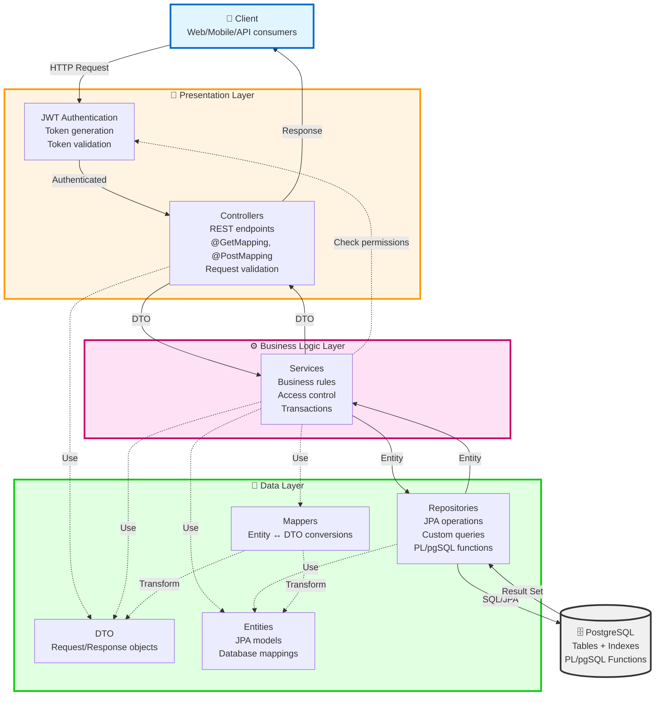

# Papers, Please - Система управления УПК (Учреждений по приему и проверке)

## 📋 Описание системы

**Papers, Please** — это информационная система для автоматизации работы учреждений по приему и проверке документов мигрантов (УПК). Система предназначена для управления процессами проверки документов, обработки заявок, координации работы персонала и мониторинга деятельности УПК.

### Основные возможности:
- 👤 Управление пользователями с различными ролями и уровнями доступа
- 📄 Управление документами мигрантов с валидацией сроков действия
- 🎫 Обработка заявок (тикетов) на различные типы услуг
- 🏢 Управление учреждениями (УПК) и их персоналом
- 👥 Формирование и управление сменами сотрудников
- 🔔 Система уведомлений для пользователей
- 📊 Отслеживание событий и действий в системе
- 🔐 JWT-аутентификация и детальная система авторизации

---

## 🛠 Технологический стек

### Backend
- **Язык**: Kotlin 2.0.21
- **Фреймворк**: Spring Boot 3.3.5
  - Spring Web (REST API)
  - Spring Data JPA (ORM)
  - Spring Security (авторизация и аутентификация)
  - Spring Validation
- **База данных**: PostgreSQL
- **Миграции**: Flyway
- **Аутентификация**: JWT (JSON Web Tokens) - `io.jsonwebtoken:jjwt 0.12.6`
- **Документация API**: SpringDoc OpenAPI 2.3.0
- **Линтер**: Detekt 1.23.8
- **Сериализация**: Jackson (с поддержкой Kotlin и JSR310)
- **Сборка**: Gradle с Kotlin DSL
- **Java**: 17

---

## 👥 Иерархия ролей

Система поддерживает 5 ролей с различными уровнями доступа:

### 1. **GOD** 🔱
- **Суперадминистратор** с полным доступом ко всем ресурсам
- Может выполнять любые операции в системе
- Обход всех проверок доступа

### 2. **BOSS** 👔
- **Начальник УПК**
- Управление персоналом своего УПК
- Просмотр и управление тикетами своего УПК
- Формирование смен
- Обработка апелляций
- Доступ только к ресурсам своего УПК

### 3. **INSPECTOR** 🔍
- **Инспектор УПК**
- Обработка тикетов своего УПК
- Проверка документов мигрантов
- Просмотр информации о тикетах и документах в рамках своего УПК

### 4. **SECURITY** 🛡️
- **Сотрудник безопасности УПК**
- Просмотр документов и тикетов своего УПК
- Доступ к информации о пользователях в рамках своего УПК

### 5. **MIGRANT** 🧳
- **Мигрант** (пользователь системы)
- Создание и управление своими документами
- Создание заявок (тикетов)
- Просмотр только своих данных

---

## 🔐 Матрица доступа к API endpoints

### 🔓 Публичные endpoints (без аутентификации)

| Endpoint | Метод | Описание |
|----------|-------|----------|
| `/api/v1/auth/register` | POST | Регистрация нового пользователя |
| `/api/v1/auth/register-god` | POST | Регистрация GOD пользователя (требуется секретный ключ) |
| `/api/v1/auth/login` | POST | Авторизация в системе |
| `/api/v1/documents/active` | GET | Получение активных документов пользователя (по userId) |

### 👤 Управление пользователями (`/api/v1/users`)

| Endpoint | Метод | Роли | Описание |
|----------|-------|------|----------|
| `GET /` | GET | BOSS, GOD | Получить всех пользователей (с пагинацией) |
| `GET /me` | GET | **ВСЕ** | Получить информацию о текущем пользователе |
| `PATCH /me` | PATCH | **ВСЕ** | Обновить информацию о текущем пользователе |
| `GET /{id}` | GET | BOSS, SECURITY, GOD | Получить пользователя по ID |
| `POST /` | POST | BOSS, GOD | Создать нового пользователя |
| `PATCH /{id}` | PATCH | BOSS, GOD | Обновить пользователя |
| `DELETE /{id}` | DELETE | BOSS, GOD | Удалить пользователя |

### 📄 Управление документами (`/api/v1/documents`)

| Endpoint | Метод | Роли | Описание |
|----------|-------|------|----------|
| `GET /` | GET | INSPECTOR, BOSS, SECURITY, GOD, MIGRANT | Получить документы по userId |
| `GET /active` | GET | **ПУБЛИЧНЫЙ** | Получить активные (не истекшие) документы |
| `GET /{id}` | GET | INSPECTOR, BOSS, SECURITY, GOD, MIGRANT | Получить документ по ID |
| `POST /` | POST | MIGRANT, GOD | Создать новый документ |
| `PATCH /{id}` | PATCH | MIGRANT, GOD | Обновить документ |
| `DELETE /{id}` | DELETE | GOD | Удалить документ |
| `GET /ticket/{ticketId}` | GET | INSPECTOR, BOSS, SECURITY, GOD | Получить документы тикета (только своего УПК)* |

> *Доступ только для сотрудников УПК, к которому относится тикет

### 🎫 Управление тикетами (`/api/v1/tickets`)

| Endpoint | Метод | Роли | Описание |
|----------|-------|------|----------|
| `GET /` | GET | INSPECTOR, BOSS, SECURITY, MIGRANT, GOD | Получить тикеты (с фильтрацией) |
| `GET /{id}` | GET | INSPECTOR, BOSS, SECURITY, MIGRANT, GOD | Получить тикет по ID |
| `POST /` | POST | INSPECTOR, BOSS, SECURITY, MIGRANT, GOD | Создать новый тикет |
| `PATCH /{id}` | PATCH | INSPECTOR, BOSS, SECURITY, GOD | Обновить тикет |
| `DELETE /{id}` | DELETE | MIGRANT, BOSS, GOD | Удалить тикет |
| `GET /{id}/documents` | GET | INSPECTOR, BOSS, SECURITY, GOD | Получить документы тикета (только своего УПК)* |
| `POST /{id}/documents/{documentId}` | POST | INSPECTOR, BOSS, SECURITY, GOD | Прикрепить документ к тикету |
| `DELETE /{id}/documents/{documentId}` | DELETE | INSPECTOR, BOSS, SECURITY, GOD | Открепить документ от тикета |
| `GET /{id}/related` | GET | INSPECTOR, BOSS, SECURITY, GOD | Получить связанные тикеты |
| `POST /{id}/related/{relatedTicketId}` | POST | INSPECTOR, BOSS, SECURITY, GOD | Связать тикеты |
| `DELETE /{id}/related/{relatedTicketId}` | DELETE | INSPECTOR, BOSS, SECURITY, GOD | Удалить связь между тикетами |

> *Доступ только для сотрудников УПК, к которому относится тикет

### 🏢 Управление УПК (`/api/v1/upks`)

| Endpoint | Метод | Роли | Описание |
|----------|-------|------|----------|
| `GET /` | GET | BOSS, GOD | Получить все УПК |
| `GET /{id}` | GET | BOSS, GOD | Получить УПК по ID |
| `POST /` | POST | BOSS, GOD | Создать новый УПК |
| `PATCH /{id}` | PATCH | BOSS, GOD | Обновить УПК |
| `DELETE /{id}` | DELETE | GOD | Удалить УПК |
| `GET /{id}/employees` | GET | BOSS, GOD | Получить сотрудников УПК (только своего УПК для BOSS)** |

> **BOSS может видеть только сотрудников СВОЕГО УПК

### 👥 Управление сменами (`/api/v1/shifts`)

| Endpoint | Метод | Роли | Описание |
|----------|-------|------|----------|
| `GET /` | GET | INSPECTOR, BOSS, SECURITY, GOD | Получить все смены |
| `GET /{id}` | GET | INSPECTOR, BOSS, SECURITY, GOD | Получить смену по ID |
| `POST /` | POST | BOSS, GOD | Создать новую смену |
| `PATCH /{id}` | PATCH | BOSS, GOD | Обновить смену |
| `DELETE /{id}` | DELETE | GOD | Удалить смену |
| `POST /{id}/participants/{userId}` | POST | BOSS, GOD | Добавить участника в смену |
| `DELETE /{id}/participants/{userId}` | DELETE | BOSS, GOD | Удалить участника из смены |

### 🔔 Управление уведомлениями (`/api/v1/notifications`)

| Endpoint | Метод | Роли | Описание |
|----------|-------|------|----------|
| `GET /` | GET | **ВСЕ** | Получить уведомления текущего пользователя |
| `PATCH /{id}/read` | PATCH | **ВСЕ** | Пометить уведомление как прочитанное |
| `DELETE /{id}` | DELETE | **ВСЕ** | Удалить уведомление |

### 📊 Управление событиями (`/api/v1/events`)

| Endpoint | Метод | Роли | Описание |
|----------|-------|------|----------|
| `GET /` | GET | BOSS, GOD | Получить все события (с фильтрацией) |
| `GET /{id}` | GET | BOSS, GOD | Получить событие по ID |

---

## 🗄️ База данных: Индексы и PL/pgSQL функции

### 📊 Индексы для оптимизации запросов

Система использует индексы для ускорения критических операций:

#### Таблица `users`
- **idx_user_email** (UNIQUE) - поиск пользователей по email при авторизации

#### Таблица `documents`
- **idx_document_owner** - быстрый поиск документов по владельцу

#### Таблица `tickets`
- **idx_ticket_executor_status** - фильтрация тикетов по исполнителю и статусу
- **idx_ticket_author** - поиск тикетов по автору

#### Таблица `notifications`
- **idx_notification_user_read_time** - получение непрочитанных уведомлений пользователя

---

### ⚡ PL/pgSQL Функции

Система использует оптимизированные PostgreSQL функции для повышения производительности критических операций.

#### 1. `get_active_documents(p_owner_id UUID)`
**Назначение**: Получение всех активных (не истекших) документов пользователя

**Возвращаемые поля**:
- `id` (UUID)
- `document_type` (VARCHAR)
- `body` (TEXT)
- `issued_at` (TIMESTAMP WITH TIME ZONE)
- `expires_at` (TIMESTAMP WITH TIME ZONE)
- `uploaded_at` (TIMESTAMP WITH TIME ZONE)
- `owner_id` (UUID)

**Логика**:
```sql
SELECT документы WHERE owner_id = p_owner_id 
  AND (expires_at IS NULL OR expires_at > NOW())
```

**Применение**: Просмотр документов мигранта, проверка документов инспектором

---

#### 2. `get_ticket_documents(p_ticket_id UUID)`
**Назначение**: Получение всех документов, прикрепленных к тикету

**Возвращаемые поля**:
- `id` (UUID)
- `document_type` (VARCHAR)
- `body` (TEXT)
- `issued_at` (TIMESTAMP WITH TIME ZONE)
- `expires_at` (TIMESTAMP WITH TIME ZONE)
- `owner_name` (VARCHAR) - имя владельца документа

**Логика**:
```sql
SELECT документы 
FROM documents d
JOIN ticket_documents td ON d.id = td.document_id
JOIN users u ON d.owner_id = u.id
WHERE td.ticket_id = p_ticket_id
ORDER BY d.document_type
```

**Применение**: Проверка документов инспектором при обработке заявки

---

#### 3. `get_users_by_upk(p_upk_id UUID)`
**Назначение**: Получение списка всех сотрудников УПК

**Возвращаемые поля**:
- `id` (UUID)
- `email` (VARCHAR)
- `name` (VARCHAR)
- `password_hash` (VARCHAR)
- `role` (VARCHAR)
- `upk_id` (UUID)

**Логика**:
```sql
SELECT пользователи 
FROM users u
WHERE u.upk_id = p_upk_id
ORDER BY u.role, u.name
```

**Применение**: Формирование смены начальником УПК, управление персоналом УПК

---

## 🏗️ Архитектура системы

Проект построен по классической многослойной архитектуре:



### Описание архитектурных слоев:

#### 📱 **Presentation Layer** (`controller/`, `security/`, `config/`)
Слой представления, отвечающий за взаимодействие с клиентом и безопасность:
- **Controllers**: обработка HTTP запросов/ответов, маршрутизация endpoints
- **JWT Authentication**: аутентификация, генерация и валидация токенов
- Первичная валидация данных (`@Valid`)
- Авторизация доступа (`@PreAuthorize`)

#### ⚙️ **Business Logic Layer** (`service/`)
Слой бизнес-логики, содержащий основную логику приложения:
- Реализация бизнес-правил
- Проверка прав доступа к ресурсам
- Управление транзакциями (`@Transactional`)
- Координация работы между репозиториями
- Обработка бизнес-логики документов, тикетов, УПК

#### 💾 **Data Layer** (`repository/`, `model/`, `dto/`, `mapper/`)
Слой данных, включающий работу с базой данных и структуры данных:
- **Repositories**: абстракция работы с БД, CRUD операции, кастомные SQL запросы, PL/pgSQL функции
- **Entities**: JPA сущности, отображающие таблицы базы данных
- **DTO**: объекты передачи данных между слоями
- **Mappers**: преобразование Entity ↔ DTO

---

## 📁 Структура проекта

```
papersplease/
├── src/main/kotlin/com/arekalov/papersplease/
│   ├── config/           # Конфигурация Spring (Security, JWT)
│   ├── controller/       # REST API контроллеры
│   │   ├── AuthController.kt
│   │   ├── UserController.kt
│   │   ├── DocumentController.kt
│   │   ├── TicketController.kt
│   │   ├── UpkController.kt
│   │   ├── ShiftController.kt
│   │   ├── NotificationController.kt
│   │   ├── EventController.kt
│   │   └── ParticipationController.kt
│   ├── service/          # Бизнес-логика
│   ├── repository/       # JPA репозитории
│   ├── model/            # Entities и Enums
│   ├── dto/              # Data Transfer Objects
│   ├── mapper/           # Mappers (Entity ↔ DTO)
│   ├── security/         # JWT и Security
│   ├── validation/       # Custom validators
│   └── exception/        # Exception handlers
├── src/main/resources/
│   ├── application.yaml  # Конфигурация приложения
│   └── db/migration/     # Flyway миграции
├── docs/                 # Документация
│   ├── openapi.yaml      # OpenAPI спецификация
│   └── wiki/             # Wiki документация
├── scripts/              # SQL скрипты (seed, clear)
│   ├── seed-data-prod.sql
│   ├── clear-data-prod.sql
│   └── fix-functions.sql
├── deployment/           # Скрипты для деплоя
│   ├── deploy.sh
│   ├── start.sh
│   └── application-prod.yaml
└── build.gradle.kts      # Gradle конфигурация
```

---

## 🚀 Запуск проекта

### Требования
- Java 17+
- PostgreSQL 14+
- Gradle 9.2+

### Настройка переменных окружения

```bash
export DB_URL="jdbc:postgresql://localhost:5432/papersplease"
export DB_USERNAME="your_username"
export DB_PASSWORD="your_password"
export JWT_SECRET="your-secret-key-at-least-256-bits"
export GOD_SECRET_KEY="super-secret-god-key"
```

### Запуск

```bash
# Сборка проекта
./gradlew build

# Запуск приложения
./gradlew bootRun

# Или через JAR
java -jar build/libs/papersplease-0.0.1-SNAPSHOT.jar
```

Приложение будет доступно по адресу: `http://localhost:8080`

### Применение SQL функций

Если функции еще не созданы, выполните:

```bash
psql -U your_username -d papersplease -f scripts/fix-functions.sql
```

