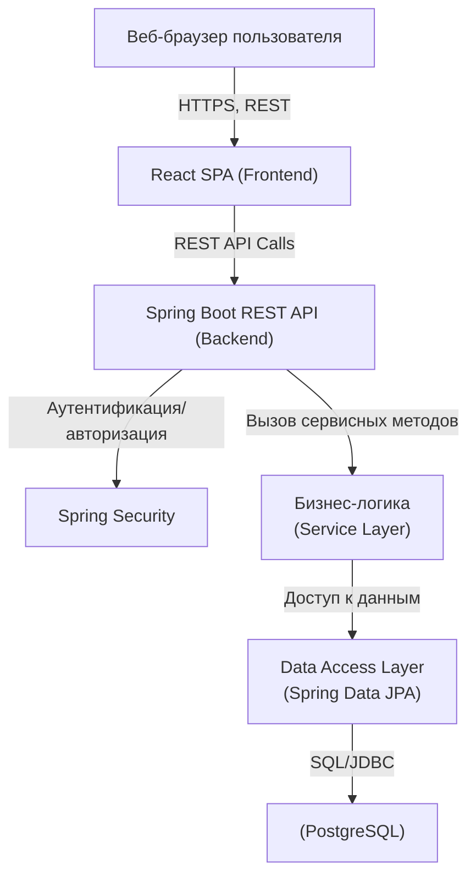



1. Согласовать с преподавателем предметную область, для которой будет разрабатываться информационная система.

2. Составить подробное текстовое описание предметной области.

3. Сформулировать, зачем нужна информационная система для представленной предметной области, какие задачи она позволит решить.

4. Составить функциональные/нефункциональные требования к разрабатываемой информационной системе.

5. Построить модели основных прецедентов (прецеденты согласуются с преподавателем), составить их описание.

6. Предложить архитектуру будущей системы. При составлении архитектуры необходимо учитывать, что все этапы курсовой работы необходимо будет демонстрировать на сервере `helios`. Согласовать с преподавателем технологии и фреймворки, которые будут использоваться при реализации системы. Для реализации системы можно использовать:
   a. Frontend: React, Angular, Vue, Next JS, JSF, Spring MVC (Thymeleaf или другой шаблонизатор).
   b. Backend: основанный на Jakarta EE или Spring MVC
   ​​​​​​​c. БД: PostgreSQL

7. Составить отчет.



## 1 Согласовать с преподавателем предметную область

Согласовано на первом лабораторном занятии.

&nbsp;

## 2 Составить подробное текстовое описание предметной области.

Информационная система по вселенной игры ["Papers, please" ](https://www.papersplea.se/).  Действие происходит в стране Арстоцка.

> **"Papers, Please"** — это инди-игра, действие которой происходит в вымышленном тоталитарном государстве Арстоцка в 1982 году. Мир игры состоит из нескольких противоборствующих и конкурирующих стран, между которыми существует напряжённая политическая ситуация—стык холодной войны, закрытых границ и массовых эмиграций.

ИС реализована для конкретного участка пограничного контроля и предназначена для эффективносй коммуникации между сотрудниками, а также ускорения процесса проверки.  Каждый УПК состоит из инспекторов, охранников и начальника участка.

### Смена состоит из нескольких этапов:

1. Приход повестки с новыми событиями на УПК.

2. Открытие рабочей смены начальником УПК.

3. Формирование штата на конкретную смену, распределение ролей, исходя из повестки.

4. Формирование повестки для конкретного сотрудника (только релевантные события).

5. Открытие смены, разблокировка доступа инспекторов к системе.

6. Работа УПК.

7. Закрытие рабочей смены, утверждение зарплаты сотрудников.

### Роли пользователей и их возможности

1. **Мигранты**:

   * Заполняют **документы** и заводят заявки

   * Может следить за статусом активной заявки

   * В результате получает либо реджект, либо аппрув

2. **Инспекторы**:

   * Проверяют приходящие **заявки** (отображаются в системе в виде канбана)

   * Имеют специализацию, знают только про события и обработку документов, относящие только к ней:

     1. Паспортист - самый общий инспектор

     2. Для местных - обладает специфическими знаниями про обработку местных

     3. По рабочим случаям - обладает специфическими знаниями про обработку случаев, связанных с работой

     4. Для транзитников

     5. Для спецслучаев (террористы, политики)

   * В начале рабочего дня получают **повестку** с событиями в соответствии с их специализацией

   * В конце рабочего дня получают зарплату или штрафы в соответствии с их производительностью и ошибками за день

   * Прикреплен к определенному начальнику

   * Если в этот день нет смены, то взаимодействие с заявками недоступно

3. Начальники:

   * В начале рабочего дня получает **повестку** со всеми **событиями,** в соответствии с которой выбирает штат сотрудников на текущий день и распределяет между ними события из повестки в соответствии со специализацией

   * Каждый день на начальника заводится тикет, в котором перечислены случайный список действий подчиненных Инспектором, которые он должен проверить, если он находит в них ошибки, то ответственных за них Инспекторов штрафуют

   * Может поощрять соотрудников коэффициентами к зарплате, например если долгое время он не совершали ошибок

4. СБ:

   * Нужны для обработки заявок типа "**Арест**"

5. Бог (служебная роль для администрирования эмулирования процессов системы):

   - Меняет повестки

   - Удаляет любые сущности

Подробнее про сущности в https://wiki.yandex.ru/homepage/papers-please-system/zashhita-i-jetapa/kljuchevye-sushhnosti/

&nbsp;

## 3 Сформулировать, зачем нужна информационная система для представленной предметной области, какие задачи она позволит решить.

ИС для разных ролей решает разные проблемы, но общая и ключевая ее задача - ускорять взаимодействие между сотрудниками, благодаря упрощению восприятия бизнес процессов, а также их ускорению.

Рассмотрим задачи, решаемые информационной системы для всех ролей:

**Мигрант:**

- Нет нужды стоять в очереди на границе, всю процедуру можно пройти онлайн.

- Можно заранее узнать список необходимых документов и подгрузить их в систему.

- Быстрее выносится вердикт о возможности въезда.

**Инспектор:**

- Четкое разграничение функций инспектора на конкретную смену позволяет делать работу быстрее.

- Автоматический инструмент проверки документов ускоряет рутину.

- Канбан доска со всеми тикетами позволяет не забыть ни о чем.

- Актуальная повестка для конкретного сотрудника позволяет не отвлекаться на нерелевантные события, а также не забывать про изменения в законодательстве.

**Начальник**:

- Возможность укомплектовать смену перед ее началом дистанционно (можно сбалансировать нагрузку на сотрудников, чтобы смена прошла максимально эффективно)

- Система автоматической случайно проверки инспекторов помогает держать работников в тонусе, наказывать провинившихся и повышать общий уровень качества работы.

- Автоматическое начисление зарплаты, возможность использовать премирующие коэффициенты в конце дня.

**СБ:**

- Быстрое получение наводки на нарушителя -\> быстрое реагирование.

&nbsp;

## 4 Составить функциональные/нефункциональные требования к разрабатываемой информационной системе.

### **4.1. Функциональные требования**

#### **Для всех пользователей (общие) должна быть возможность:**

4\.1.1. Зарегистрироваться и войти в систему по своей роли (мигрант, инспектор, начальник, сб, бог).

4\.1.2. Пройти аутентификации и авторизации (разграничение доступа по ролям).

4\.1.3 Просматривать свой профиль и изменять персональные данные.

#### **Для мигранта должна быть возможность:**

4\.1.4.  Создания нового заявка на пересечение границы, заполнение анкеты, загрузка требуемых документов.

4\.1.5. Отслеживания статуса своей заявки в режиме реального времени.

4\.1.6. Получения уведомлений об изменении статуса заявки и о решении (одобрено/отказано).

4\.1.7. Просмотра истории поданных заявок и решений по ним.

#### **Для инспектора должна быть возможность:**

4\.1.8. Просмотра списка тикетов в виде Kanban-доски (новые, в обработке, завершённые).

4\.1.9. Фильтрации и поиска тикетов по статусу, типу, дате.

4\.1.10. Проверки документов заявителя с возможностью добавления заметок и комментирования.

4\.1.11. Принятия решения по тикету: одобрение/отказ, формирование причины отказа.

4\.1.12. Получения и просмотра повестки на текущий день, где отражены только актуальные для инспектора события и задачи.

4\.1.13. Просмотра полученной за смену зп и штрафов.

#### **Для начальника должна быть возможность:**

4\.1.14. Просмотра повестки со всеми текущими событиями смены.

4\.1.15. Формирования и редактирования состава смены, назначение сотрудников на конкретные роли и события.

4\.1.16. Просмотра отчетов смены, утверждение зарплат и/или премирование сотрудников.

4\.1.17. Просмотр аавтоматических тикетов дня для проверки работы инспекторов.

4\.1.18. Вынесения штрафов/бонусов инспекторам по результатам проверки.

4\.1.19. Ведение аналитики по производительности смен и сотрудников.

#### **Для СБ должна быть возможность:**

4\.1.20. Получения тикетов на арест/оповещение о нарушениях.

4\.1.21. Отмечать исполнение тикетов на арест.

#### **Для всех сотрудников должна быть возможность:**

4\.1.22. Просмотра списка текущих и завершённых тикетов.

4\.1.23. Получения уведомлений о событиях, новых тикетов, изменениях статуса тикетов, истечению дедлайнов по тикету.

4\.1.24. Просмотра расписания смен и истории своих действий.

4\.1.25. Просмотра отчета смены.

#### **Для бога (администратора) должна быть возможность:**

4\.1.26. Создать повестку

4\.1.27. Настроить течение времени

4\.1.28. Быстро добавить новых пользователей

### **Нефункциональные требования**

**4.2. Usability Requirements:**

4\.2.1. Доступна документация по работе с системой для всех ролей.

4\.2.2. Настраиваемые уведомления для ключевых событий.

4\.2.3. Поддержка работы в основных браузерах (Chrome, Firefox, Edge).

4\.2.4. Доступность интерфейса в соответствии с рекомендациями WAI и WCAG

**4.3. Reliability and Performance Requiremenets:**

4\.3.1. Система должна обеспечивать отклик интерфейса менее 1,5 секунды на стандартные действия пользователя.

4\.3.2. Система должна выдерживать одновременную работу не менее 100 пользователей.

4\.3.3. Система должна хранить данные заявок и истории изменений не менее 5 лет.

4\.3.4. Система должна автоматическое логирование ошибок и критичных событий.

**4.4. Security Requirements:**

4\.4.1. Разграничение прав доступа по ролям (мигрант, инспектор, начальник, охранник, бог).

4\.4.2. Аутентификация по логину-паролю, поддержка смены пароля и восстановления доступа.

4\.4.3. Все сетевые соединения должны использовать HTTPS.

4\.4.4. Валидация входных данных на фронте и бэкенде.

**4.5. Интеграция и стандарты работы:**

4\.5.1. Интеграция фронтенда (React) и бэкенда (Spring) через REST API (JSON).

**4.6 Deployment Requirements:**

4\.6.1. Возможность развертывания и демонстрации системы на сервере `helios`.

4\.6.2. Использование PostgreSQL как основной базы данных.

4\.6.3. Документированная инструкция по деплою и настройке.

4\.6.4. возможность разнести фронтенд, бэкенд, базу на разные сервера.

&nbsp;

## 5 Построить модели основных прецедентов (прецеденты согласуются с преподавателем), составить их описание.

```
Use case

@startuml
top to bottom direction

actor Мигрант
actor Инспектор
actor Начальник
actor СБ
actor Бог

' --- Use cases Users ---
usecase "Регистрация" as UC1
usecase "Создание учетной записи" as UC2
usecase "Вход в систему" as UC3
usecase "Создание заявки" as UC4
usecase "Загрузка документов" as UC5
usecase "Просмотр заявок/истории" as UC7
usecase "Получить уведомление" as UC6
usecase "Подача апелляции" as UC24
usecase "Прикрепить доп. документы\nк апелляции" as UC25

' --- Use cases Inspector ---
usecase "Просмотр тикетов" as UC8
usecase "Проверка документов" as UC9
usecase "Принять решение по заявке" as UC10
usecase "Кросс-проверка" as UC11
usecase "Рассмотрение апелляции" as UC26

' --- Use cases Начальник ---
usecase "Просмотр повестки" as UC12
usecase "Формирование смены" as UC13
usecase "Назначение сотрудников" as UC14
usecase "Проверка работы инспекторов" as UC15
usecase "Просмотр отчёта смены" as UC16
usecase "Вынести штраф" as UC17
usecase "Премировать сотрудника" as UC18
usecase "Проверка апелляции" as UC27

' --- Use cases СБ и Бог---
usecase "Получение тикета на арест" as UC19
usecase "Исполнение тикета на арест" as UC20
usecase "Управление повестками" as UC21
usecase "Администрирование пользователей" as UC22
usecase "Настройка времени" as UC23
usecase "Проверка апелляции по\незаконной деятельности" as UC28

' --- Ассоциации для подачи и проверки апелляции ---
Мигрант -- UC24
UC24 <.. UC25 : <<extend>>
UC24 ..> UC6 : <<extend>>
UC24 ..> UC26 : <<include>> 

Инспектор -- UC26
UC26 ..> UC27 : <<extend>>  

Начальник -- UC27
UC27 ..> UC28 : <<extend>> 

СБ -- UC28

' --- Остальные основные связи ---
Мигрант -- UC1
Мигрант -- UC3
Мигрант -- UC4
Мигрант -- UC7
Мигрант -- UC5

UC5 ..> UC4 : <<extend>>
UC5 ..> UC1 : <<extend>>
UC6 ..> UC4 : <<extend>>
UC6 ..> UC7 : <<extend>>
UC2 ..> UC1 : <<include>>

Инспектор -- UC3
Инспектор -- UC8
Инспектор -- UC9
Инспектор -- UC10
Инспектор -- UC11
UC9 <.. UC8 : <<include>>
UC6 ..> UC10 : <<extend>>
UC6 ..> UC11 : <<extend>>

Начальник -- UC3
Начальник -- UC12
Начальник -- UC13
Начальник -- UC14
Начальник -- UC15
UC16 <.. UC15 : <<include>>
UC17 ..> UC15 : <<extend>>
UC18 ..> UC15 : <<extend>>
UC14 <.. UC13 : <<include>>

СБ -- UC3
СБ -- UC19
UC20 <.. UC19 : <<include>>
UC6 ..> UC20 : <<extend>>

Бог -- UC21
Бог -- UC22
Бог -- UC23
@enduml
```


### Основные Use Cases:


|Прецедент: Назначение повестки на день, вывод сотрудников на смену.||
|:---|:---|
|**ID:** 101||
|**Краткое описание:** Начальник участка формирует и назначает повестку на текущий день, выводит сотрудников на смену и распределяет задачи согласно специализациям. Сотрудники получают свою повестку, открывают смену и начинают разбирать тикеты.||
|**Актеры:** начальник, инспекторы, сб.||
|**Предусловия:** Наступил день смены, в системе есть повестка и сотрудники. Начальник авторизован.||
|**Основной поток:**||
|1. Начальник заходит в раздел управления сменой.||
|2. Система отображает текущую повестку дня (список событий, требования, особенности смены).||
|3. Начальник выбирает доступных сотрудников и назначает их на смену согласно специализациям (начальник может правильно сбалансировать смену за счет вывода правильного количества сотрудников нужной специализации)||
|4. После согласования состава смены начальник формирует повестку для каждого сотрудника (выбирает из общей повестки события релевантные для конкретного сотрудника).||
|5. Система сохраняет состав смены и персональные повестки для сотрудников.||
|6. Система уведомляет сотрудников о назначении на смену и их индивидуальной повестке. Разрешает доступ к смене.||
|7. Сотрудник заходит в систему, изучает повестку и задачи на текущий день.||
|**Альтернативный поток:**||
|- Если недостаточно сотрудников нужной специализации, система уведомляет начальника и предлагает перераспределить задачи либо оставить некоторые события нераспределёнными.||
|- Если повестка не утверждена (например, бог правит её в последний момент), вывод сотрудников откладывается до согласования повестки.||
|**Постусловия:** Сформирован состав смены, назначены сотрудники, каждому назначены события повестки, сотрудники оповещены.||

```
@startuml
left to right direction

actor Начальник
actor Инспектор
actor СБ

Инспектор <|-- СБ

rectangle "101 Назначение повестки на день, вывод сотрудников на смену." {
  (Управление сменой)
  (Просмотр текущей повестки)
  (Назначение сотрудников на смену)
  (Формирование индивидуальных повесток)
  (Сохранение состава смены)
  (Уведомление сотрудников)
  (Просмотр своей повестки и задач)
}

Начальник -- (Управление сменой)
(Управление сменой) ..> (Просмотр текущей повестки) : <<include>>
(Управление сменой) ..> (Назначение сотрудников на смену) : <<include>>
(Управление сменой) ..> (Формирование индивидуальных повесток) : <<include>>
(Управление сменой) ..> (Сохранение состава смены) : <<include>>
(Управление сменой) ..> (Уведомление сотрудников) : <<include>>
(Уведомление сотрудников) -- Инспектор
Инспектор -- (Просмотр своей повестки и задач)
@enduml
```


|Прецедент: Флоу заявки мигранта|
|:---|
|**ID:** 102|
|**Краткое описание:** Обработка заявки мигранта от создания до принятия решения по заявке|
|**Акторы:** Мигрант, Инспектор-паспортист, Специализированный инспектор (например, по рабочим случаям)|
|**Предусловия:** Мигрант авторизован в системе.|
|**Основной поток:**|
|1. Мигрант|
|\* Заполняет электронную заявку, прикрепляет документы.|
|\* Заявка получает статус Proposed.|
|2. Система|
|\* Автоматически распределяет заявку среди свободных инспекторов-пастортистов.|
|\* При необходимости рассылает уведомления по ролям.|
|3. Инспектор-паспортист|
|Получает заявку — первичная (общая) проверка документов и личности.|
|Если первичная проверка проходит, при этом нет специальных документов для проверки:|
|Заявка закрывается со статусом Closed с причиной Approved|
|Если всё ок, но требуется проверка специальных документов:|
|Передаёт заявку инспектору по специализации, заводится дочерний тикет на инспектора-специалиста.|
|Если что-то не так:|
|Возвращает заявку Мигранту на доработку (заявка переходит в Need Info).|
|Как только мигрант внесет изменения, заявка вернется Инспектору со статусом Active|
|Инспектор-специалист|
|1. Проводит проверку по своей специализации (например, рабочие документы, трудовой контракт).|
|2. Одобряет/отказывает/запрашивает доп. документы аналогично пастортисту.|
|Мигрант|
|Получает уведомление, видит финальное решение (или получает запрос на доп. документы).|
|В случае отказа — указывает причину, мигранту отправляется уведомление.|
|Альтернативные потоки:|
|Если мигрант не ответил на доработку в срок — заявка закрывается по таймауту.|
|Если разные инспекторы вынесли противоречивые решения — система эскалирует заявку начальнику.|
|Постусловие:  Заявка обработана со статусом Closed с причиной Approved или Reject|

```
@startuml
left to right direction

' Use-case diagram for: Флоу заявки мигранта

actor Мигрант
actor "Инспектор-паспортист" as Паспорт
actor "Специализированный инспектор" as Спец

package "102 Флоу заявки мигранта" {
  (Заполнить электронную заявку)
  (Прикрепить документы)
  (Получить уведомление)
  (Проверить документы и личность)
  (Передать заявку на доработку)
  (Эскалировать заявку начальнику)
  (Передать заявку специалисту)
  (Провести специальную проверку)
  (Закрыть заявку: Approved/Rejected/Need Info)
}

' Связи Мигранта
Мигрант -- (Заполнить электронную заявку)
(Заполнить электронную заявку) ..> (Прикрепить документы) : <<include>>
(Заполнить электронную заявку) ..> (Получить уведомление) : <<extend>>
Мигрант -- (Получить уведомление)

' Когда заявка отправлена - работа паспортиста
Паспорт -- (Проверить документы и личность)
(Проверить документы и личность) ..> (Передать заявку специалисту) : <<extend>>
(Проверить документы и личность) ..> (Передать заявку на доработку) : <<extend>>
(Проверить документы и личность) ..> (Закрыть заявку: Approved/Rejected/Need Info) : <<include>>
(Передать заявку специалисту) ..> (Провести специальную проверку) : <<include>>
(Передать заявку на доработку) -- Мигрант

' Работа специалиста
Спец -- (Провести специальную проверку)
(Провести специальную проверку) ..> (Закрыть заявку: Approved/Rejected/Need Info) : <<include>>
(Провести специальную проверку) ..> (Передать заявку на доработку) : <<extend>>

' Эскалация
(Закрыть заявку: Approved/Rejected/Need Info) ..> (Получить уведомление) : <<extend>>
(Проверить документы и личность) ..> (Эскалировать заявку начальнику) : <<extend>>

@enduml
```


|Прецедент: Ежедневная кросс-проверка сотрудников друг-другом.|
|:---|
|**ID:** 103|
|**Краткое описание:** Каждый день из случайных вердиктов сотрудников формируется тикет на проверку для любого другого сотрудника. Его цель – проверить действия коллеги и вынести вердикт, верно ли тот провел проверку. В конце требуется указать согласие или несогласие с решением коллеги с подробным описанием. Эти данные в анонимизированном виде отправляются сотруднику, которого проверяли. Он может подать апелляцию, которая попадет начальнику.|
|**Акторы:** Инспектор, инспектор с другой специализацией, начальник.|
|**Предусловия:** Сотрудник выполнил проверку и вынес решение. Система выбрала её в качестве субъекта для кросс-проверки.|
|**Основной поток:**|
|1. Инспектору приходит тикет АТСП на другого сотрудника.|
|2. Инспектор проверяет работу коллеги, оценивает наличие ошибки.|
|3. Проверяющий инспектор выносит вердикт и описывает, почему принято такое решение.|
|4. Результат кросс-проверки в анонимном виде показывается проверяемому сотруднику с пояснением.|
|5. Если сотрудник не согласен с вердиктом, он подаёт апелляцию.|
|6. Тикет с апелляцией поступает начальнику, который принимает финальное решение.|
|7. По результату проверки фиксируется одно из четырёх решений:|
|- Назначение штрафа инспектору, совершившему ошибку; проверяющий был прав.|
|- Назначение штрафа проверяющему, если первый инспектор был прав.|
|- Наказание обоим, если оба не учли важные обстоятельства (например, события повестки).|
|- Никого не наказывают, если ситуация трактуется двояко по законам.|
|**Альтернативный путь:**|
|- Если тикетов на проверку нет - ничего не происходит.|
|**Постусловие:** В системе появляется отметка о количестве ошибок сотрудника по результатам кросс-проверки. Результаты влияют на его зарплату.|

```
@startuml
' Use-case diagram for: Ежедневная кросс-проверка сотрудников друг-другом

actor "Инспектор (проверяемый)" as Insp1
actor "Проверяющий инспектор" as Insp2
actor Начальник

package "103  Ежедневная кросс-проверка сотрудников друг-другом" {
  (Получить тикет на проверку коллеги)
  (Проверить работу коллеги)
  (Вынести вердикт по коллеге)
  (Получить анонимизированное уведомление)
  (Подать апелляцию)
  (Финальное решение по апелляции)
  (Назначить штраф или премию)
  (Отметить ошибку в статистике)
}

' Инспектор-проверяющий
Insp2 -- (Получить тикет на проверку коллеги)
(Получить тикет на проверку коллеги) ..> (Проверить работу коллеги) : <<include>>
(Проверить работу коллеги) ..> (Вынести вердикт по коллеге) : <<include>>

' Инспектор-проверяемый
Insp1 -- (Получить анонимизированное уведомление)
(Вынести вердикт по коллеге) ..> (Получить анонимизированное уведомление) : <<include>>
(Получить анонимизированное уведомление) <.. (Подать апелляцию) : <<extend>>
Insp1 -- (Подать апелляцию)

' Начальник разбирает апелляцию
Начальник -- (Финальное решение по апелляции)
(Подать апелляцию) ..> (Финальное решение по апелляции) : <<include>>
(Финальное решение по апелляции) ..> (Назначить штраф или премию) : <<include>>
(Назначить штраф или премию) ..> (Отметить ошибку в статистике) : <<include>>
@enduml
```


|Прецедент: Флоу заявки аппелляции|
|:---|
|**ID:** 104|
|**Краткое описание:** Обработка Начальником заявки мигранта  с апелляцией|
|**Акторы:** Мигрант, Начальник, Инспектор, СБ|
|**Предусловия:** Мигрант и Начальник авторизован в системе, Инспектор отказал мигранту в заявке|
|**Основной поток:**|
|1. Мигрант заводит заявку с апелляцией, описывает в ней, почему решение инспектора несправедливо, при необходимости прикрепляет дополнительные документы|
|2. Система переводит заявку на Начальника Инспектора, который отказал в заявке|
|3. Начальник обрабатывает заявку апелляции, определяет справедливость вердикта Инспектора|
|4. Решение несправедливое, то заявка закрывается со статусом Approved, а ответственный за нее Инспектор получает штраф|
|Альтернативный путь:|
|Если решение Инспектора справедливое, то заявка переходит в статус Pending SB Approve и переводится на случайного сотрудника СБ|
|СБ проверяет заявку на предмет злоупотребления, явных ошибок, допущенных Инспектором и не замеченных Начальником|
|Если проверка проходит и СБ принимает решение начальника, то заявка закрывается со статусом Rejected, а подавший ее мигрант на время теряет возможность создавать заявки|
|Иначе он направляет официальное письмо на руководителя департамента УПК с подозрениями на злоупотребление служебными полномочиями|
|**Постусловие**: Заявка закрыта с причиной Approved, ответственный за заявку Инспектор получает штраф, или Rejected, в таком случае мигрант на время теряет возможность подавать заявки|

```
@startuml
' Use-case diagram for: Флоу заявки апелляции

actor Мигрант
actor Начальник
actor Инспектор
actor СБ

package "104 Флоу заявки аппелляции" {
  (Подать заявку-апелляцию)
  (Прикрепить доп. документы)
  (Рассмотреть апелляцию) 
  (Вынести решение по апелляции)
  (Штраф инспектору)
  (Ограничить мигранту подачу заявок)
  (Проверка СБ по апелляции)
  (Письмо руководителю УПК)
  (Закрыть заявку: Approved/Rejected)
}

Мигрант -- (Подать заявку-апелляцию)
(Подать заявку-апелляцию) <.. (Прикрепить доп. документы) : <<extend>>

(Подать заявку-апелляцию) ..> (Рассмотреть апелляцию) : <<include>>
Начальник -- (Рассмотреть апелляцию)
(Рассмотреть апелляцию) ..> (Вынести решение по апелляции) : <<include>>
(Вынести решение по апелляции) <.. (Штраф инспектору) : <<extend>>
(Вынести решение по апелляции) <.. (Закрыть заявку: Approved/Rejected) : <<include>>

(Вынести решение по апелляции) <.. (Проверка СБ по апелляции) : <<extend>>
СБ -- (Проверка СБ по апелляции)
(Проверка СБ по апелляции) <.. (Ограничить мигранту подачу заявок) : <<extend>>
(Проверка СБ по апелляции) <.. (Письмо руководителю УПК) : <<extend>>
(Проверка СБ по апелляции) ..> (Закрыть заявку: Approved/Rejected) : <<include>>

Инспектор -- (Штраф инспектору)
@enduml
```


---

&nbsp;

&nbsp;


|Прецедент: Регистрация мигранта|
|:---|
|**ID:** 1|
|**Краткое описание:** Мигрант регистрируется в системе.|
|**Главный актёр:** Мигрант|
|**Предусловия:** Мигрант не зарегистрирован в системе.|
|**Основной поток:**|
|1. Мигрант заполняет форму регистрации, e-mail и другие данные.|
|2. Создает пароль.|
|3. Система проверяет корректность данных и создает учетную запись.|
|4. Мигрант получает уведомление об успешной регистрации.|
|**Альтернативный поток:**|
|- Если e-mail уже зарегистрирован, система предлагает восстановить доступ или выбрать другой e-mail.|
|- Если данные некорректны, система уведомляет пользователя и предлагает исправить ошибки.|
|**Постусловия:** Создана учетная запись, мигрант может войти.|


|Прецедент: Вход пользователя в систему|
|:---|
|**ID:** 2|
|**Краткое описание:** Пользователь проходит аутентификацию для доступа к своим функциям согласно роли.|
|**Главный актёр:** Любой пользователь|
|**Предусловия:** Пользователь зарегистрирован в системе.|
|**Основной поток:**|
|1. Пользователь вводит логин и пароль.|
|2. Система проверяет корректность данных.|
|3. При успешной аутентификации предоставляет доступ к функциям, соответствующим его роли.|
|**Альтернативный поток:**|
|- Если данные неверны, система показывает сообщение "Неверный логин или пароль".|
|- Если учетная запись заблокирована, система не дает войти.|
|**Постусловия:** Пользователь получил доступ к системе.|


||
|:---|
||


|Прецедент: Просмотр статуса и истории заявок мигрантом|
|:---|
|**ID:** 4|
|**Краткое описание:** Мигрант отслеживает статусы своих заявок и просматривает их историю.|
|**Главный актёр:** Мигрант|
|**Предусловия:** В системе есть хотя бы одна заявка мигранта.|
|**Основной поток:**|
|1. Мигрант открывает раздел "Мои заявки".|
|2. Система отображает список заявок со статусами (на рассмотрении/одобрено/отказано/требует дополнительной информации/арест).|
|3. Мигрант выбирает заявку и видит подробности и историю изменений.|
|**Альтернативный поток:**|
|- Если историй нет, система сообщает о пустом списке.|
|**Постусловия:** Мигрант ознакомился со статусами и изменениями своих заявок.|


|Прецедент: Получение уведомления мигрантом о решении по заявке|
|:---|
|**ID:** 5|
|**Краткое описание:** Мигрант получает автоматическое уведомление об изменении статуса своей заявки.|
|**Главный актёр:** Мигрант|
|**Предусловия:** Заявка изменена инспектором или начальником.|
|**Основной поток:**|
|1. Статус заявки обновляется (одобрено, отказано, запрос доп. информации, арест).|
|2. Мигранту приходит уведомление.|
|3. Мигрант видит уведомление и может перейти к подробностям заявки.|
|**Альтернативный поток:**|
|- Если уведомления отключены, мигрант узнает о решении только в личном кабинете.|
|**Постусловия:** Мигрант оповещён о статусе.|


|Прецедент: Проверка и обработка заявок инспектором|
|:---|
|**ID:** 6|
|**Краткое описание:** Инспектор получает, проверяет и выносит решение по заявкам в своей специализации.|
|**Главный актёр:** Инспектор|
|**Предусловия:** Доступен хотя бы один тикет для инспектора, инспектор авторизован.|
|**Основной поток:**|
|1. Инспектор открывает список тикетов (Kanban-доска).|
|2. Выбирает тикет и просматривает документы.|
|3. Принимает решение — одобрить, отказать, запросить доп. информацию или эскалировать.|
|4. Система сохраняет решение и отправляет уведомление мигранту.|
|**Альтернативный поток:**|
|- Если документы нечитаемы, инспектор отправляет тикет на доработку мигранту.|
|- Если возникло подозрение на нарушение, инспектор помечает тикет и отправляет в СБ.|
|**Постусловия:** Тикет обработан, мигрант и другие заинтересованные лица уведомлены.|


|Прецедент: Получение и просмотр повестки инспектором|
|:---|
|**ID:** 7|
|**Краткое описание:** Инспектор просматривает индивидуальную повестку на текущую смену.|
|**Главный актёр:** Инспектор|
|**Предусловия:** Для инспектора сформирована повестка на день, инспектор авторизован, назначен на смену начальником.|
|**Основной поток:**|
|1. Инспектор заходит в раздел "Моя повестка".|
|2. Система показывает список событий.|
|3. Инспектор знакомится с событиями.|
|**Постусловия:** Инспектор знает свою повестку на смену.|


|Прецедент: Распределение задач между сотрудниками начальником|
|:---|
|**ID:** 8|
|**Краткое описание:** Начальник формирует состав смены и распределяет задачи между сотрудниками в соответствии со специализациями.|
|**Главный актёр:** Начальник|
|**Предусловия:** Сформирована повестка дня, сотрудники назначены на смену.|
|**Основной поток:**|
|1. Начальник заходит в панель управления сменой.|
|2. Просматривает события повестки.|
|3. Назначает сотрудников на смену.|
|4. Сохраняет и публикует распределение.|
|**Постусловия:** Задачи расставлены, сотрудники оповещены о назначениях.|


|Прецедент: Проверка работы инспекторов начальником (АТСП)|
|:---|
|**ID:** 9|
|**Краткое описание:** Начальник получает АТСП для проверки действий подчинённых, может вынести штраф.|
|**Главный актёр:** Начальник|
|**Предусловия:** Смена идет, АТСП у сгенерирован автоматически.|
|**Основной поток:**|
|1. Начальник открывает АТСП на проверку.|
|2. Изучает список действий инспекторов.|
|3. При необходимости выставляет штраф.|
|4. Комментирует и закрывает тикет.|
|**Постусловия:** Итоги проверки учтены в зарплате и статистике сотрудника.|


|Прецедент: Получение и исполнение тикета на арест СБ|
|:---|
|**ID:** 10|
|**Краткое описание:** СБ получает задачу на арест и отмечает её исполнение по результату действия.|
|**Главный актёр:** СБ|
|**Предусловия:** Доступен хотя бы один тикет на арест, СБ авторизован.|
|**Основной поток:**|
|1. СБ видит новый тикет "Арест".|
|2. Исполняет действие и отмечает в системе выполнение.|
|3. Система обновляет статус тикета и уведомляет начальника.|
|**Постусловия:** Тикет "Арест" закрыт.|


|Прецедент: Просмотр и утверждение смены начальником|
|:---|
|**ID:** 11|
|**Краткое описание:** Начальник просматривает отчет смены, утверждает начисление зарплаты и премий сотрудникам.|
|**Главный актёр:** Начальник|
|**Предусловия:** Смена завершена, отчет готов к утверждению.|
|**Основной поток:**|
|1. Начальник заходит в раздел "Отчет смены".|
|2. Проверяет данные по работе сотрудников.|
|3. Подтверждает или корректирует начисления.|
|4. Сохраняет отчет.|
|**Постусловия:** Зарплаты утверждены, сотрудники уведомлены.|


|Прецедент: Настройка и администрирование системы “богом”|
|:---|
|**ID:** 12|
|**Краткое описание:** Администратор (бог) управляет повестками, пользователями и временными параметрами системы.|
|**Главный актёр:** Бог (администратор)|
|**Предусловия:** Бог авторизован в системе.|
|**Основной поток:**|
|1. Бог заходит в панель администрирования.|
|2. Создаёт повестки, редактирует/users, управляет всей системой.|
|3. По необходимости удаляет или изменяет любые данные.|
|**Постусловия:** Система обновлена в соответствии с действиями бога.|


|Прецедент: Получение уведомлений сотрудником о новых заданиях/событиях/изменениях статуса|
|:---|
|**ID:** 13|
|**Краткое описание:** Любой сотрудник получает уведомления о новых тикетах, изменениях их статусов и важных событиях.|
|**Главный актёр:** Любой сотрудник|
|**Предусловия:** Для пользователя имеется хотя бы одно новое событие.|
|**Основной поток:**|
|1. Появляется новое событие/задание/изменение статуса.|
|2. Система отправляет уведомление сотруднику.|
|3. Сотрудник может перейти к подробностям из уведомления.|
|**Постусловия:** Сотрудник в курсе изменений в своей рабочей области.|


|Прецедент: Заполнение и сохранение документов мигрантом в личном кабинете|
|:---|
|**ID:** 14|
|**Краткое описание:** Мигрант заполняет и загружает свои личные документы в профиль для автоматического прикрепления к будущим заявкам.|
|**Главный актёр:** Мигрант|
|**Предусловия:** Мигрант зарегистрирован, авторизован и вошёл в личный кабинет.|
|**Основной поток:**|
|1. Мигрант открывает раздел личного кабинета "Мои документы".|
|2. Система отображает список обязательных для подачи заявлений документов (например, паспорт, фото, разрешение на работу и т.д.).|
|3. Мигрант вводит данные каждого документа, при необходимости загружает файлы (сканы, фото).|
|4. Мигрант сохраняет заполненные документы.|
|5. Система проверяет корректность и полноту данных, сохраняет документы в профиле мигранта.|
|6. В будущем, при создании новой заявки, система автоматически подставляет заполненные и загруженные документы из профиля.|
|**Альтернативный поток:**|
|- Если не все обязательные документы загружены, система просит дозаполнить недостающие позиции.|
|- Если файл неподходящего формата, система выводит ошибку и предлагает загрузить файл заново.|
|- Если мигрант обновляет уже существующий документ, система сохраняет новую версию.|
|**Постусловия:** Документы сохранены в профиле мигранта и автоматически используются при подаче новой заявки.|

&nbsp;

## 6 Предложить архитектуру будущей системы

### Схема архитектуры


### **1. Frontend**

* **React Single Page Application (SPA)**

  * Отдельный модуль (директория), разворачивается как сборка статики (через Vite или webpack).

  * Все юзерские интерфейсы: личный кабинет мигранта, тикеты, кабинеты инспектора, начальника, админа, охранника и пр.

  * Аутентификация пользователя, хранение токена доступа.

  * Взаимодействует с бэкендом через REST API (axios).

### **2. Backend**

* **Spring Boot (Spring MVC)**

  * Kotlin в качестве языка разработки.

  * REST-контроллеры по основным сущностям: заявки, пользователи, тикеты, смены, документы, повестки, отчёты и пр.

  * Модули работы с ролями и доступом (Spring Security: разграничение действий в зависимости от роли).

  * Сервисный слой (бизнес-логика): обработка заявок, смены, проверок, генерация уведомлений, начисление зарплаты и премий, автоматизация тикетов.

  * Подключение к PostgreSQL через JDBC \+ Hibernate.

  * Kotlin Coroutines для асинхронности

  * Интеграция с системой уведомлений email.

* **Безопасность**

  * **Spring Security** для аутентификации/авторизации по ролям (JWT-токены).

  * HTTPS для всего трафика.

  * Записи в лог всех значимых действий.

### **3. База данных**

* **PostgreSQL**

  * Все основные сущности: пользователи, роли, заявки, тикеты, документы, смены, повестки, отчёты, логи действий.

  * Связи между пользователями и ролями, заявками и документами, учёт смен, историю изменений и пр.

  * Индексы и ограничения для целостности.

  * Pg/Sql - процедуры.

### 4.Дополнительно

- Документирование API в Swagger.

- CI/CD Github Actions.

&nbsp;

